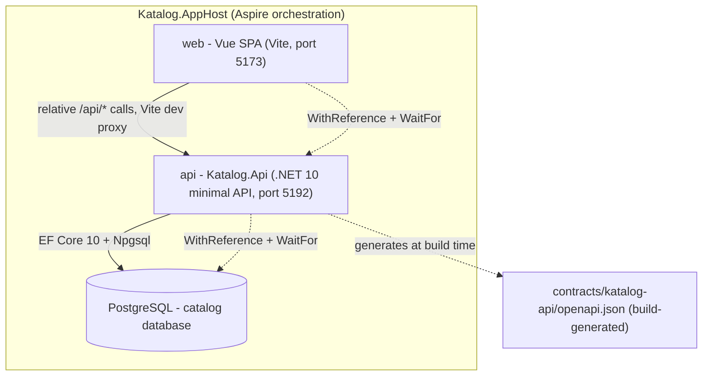

# Katalog - Architecture

## System overview

System overview: the Aspire AppHost orchestrates the Vue web app, the .NET API, and PostgreSQL; the API generates the committed OpenAPI contract.

The checked-in backend is a .NET 10 minimal API hosted by `Katalog.Api`.
`Katalog.AppHost` starts it with PostgreSQL and the Vue app through Aspire;
`contracts/katalog-api/openapi.json` is the committed build-generated contract.
`Katalog.AppHost` forces the api resource to the **Development** environment
(`ASPNETCORE_ENVIRONMENT`/`DOTNET_ENVIRONMENT`) so Spotify user-secrets load and
the startup migration runner runs, and the catalog database resource exposes a
"Reset Database" dashboard action (`reset-db`) that drops and recreates the
database for a fresh start.

### Stable ports

Three resources own a stable port so URLs are the same on every `aspire run`:

- **Dashboard/AppHost** - `https://localhost:15000`, pinned via
  `Katalog.AppHost/Properties/launchSettings.json` `applicationUrl` (the
  mechanism the Aspire CLI 13.5.x uses to pin the dashboard port).
- **api** - fixed host port **5192** via `WithHttpEndpoint(port: 5192)` in
  `Resources/Api/KatalogApi.cs`; the Vite proxy fallback references this port.
- **web** - fixed host port **5173** via `WithHttpEndpoint(port: 5173)` in
  `Katalog.AppHost/Program.cs`, matching Vite's own default so
  `vite --port 5173` serves the frontend where docs say it lives.

## Frontend (`web/`)

Vue 3.5 + TypeScript + Vite, styled with the shadcn-vue **a1AhVxI** preset
(reka-ui base, "maia" style, Hugeicons icons, Figtree font, neutral base
color, Tailwind CSS 4 via `@tailwindcss/vite`). CSS-first theming lives in
`web/src/assets/index.css` (variables + `@theme inline`).

Key structure:

- `src/views/` - route components: `HomeView`, `LabelsView` (overview),
  `LabelDetailView` (artist/release tabs).
- `src/router.ts` - lazy routes `/`, `/labels`, `/labels/:id`; sets `title`.
- `src/stores/spotify.ts` - Pinia store for Spotify Connect: session status,
  device list with client-side caching, playback state, play/pause toggle,
  and sign-in callback consumption.
- `src/stores/labels.ts` - Pinia store for labels: fetch with stale-response
  guards (`fetchId`/`revision`), follow/unfollow, mutation vs refresh
  protection.
- `src/composables/useArtistSearch.ts` - debounced Spotify artist search for
  the add-label combobox (empty queries reset without hitting the API).
- `src/api/` - **handwritten typed client** today (including `spotify.ts` for
the Spotify Connect endpoints) (`http.ts`, `types.ts`,
  `labels.ts`; `API_CLIENT_ORIGIN = 'handwritten'`); the committed
  `contracts/katalog-api/openapi.json` is available when switching to the
  generated `@hey-api/openapi-ts` client (`npm run generate:client`). Endpoint
  map: see `src/api/README.md`.
- `src/components/` - feature components (`labels/`, `albums/`, `artists/`,
  `common/`, `layout/`) plus generated shadcn-vue primitives in
  `src/components/ui/`.
- `src/lib/icons.ts` - bridge for `@hugeicons/vue` imports shadcn-vue emits
  but the package does not export (extend when re-adding components).

Dev proxy (`vite.config.ts`): SPA always calls relative `/api/*`; Vite proxies
to `API_HTTP`/`API_HTTPS` when injected (Aspire resource) with a
`http://localhost:5192` fallback.

## Backend (`apps/katalog-api/`)

`Katalog.Api` is a .NET 10 minimal API with vertical slices, an in-process
release-polling `BackgroundService`, EF Core 10 + Npgsql against one
`catalog` Postgres database, migrations via `--migrate` in the same binary, and
the committed OpenAPI contract in `contracts/katalog-api/openapi.json`.
Aspire orchestration is provided by `Katalog.AppHost`. Spotify data comes from
a client-credentials app token; Spotify Connect playback control additionally uses
the signed-in user's own OAuth token (see the Connect sections below).
Source of truth: `data/katalog-arch-ref-q1/report.md` (external to this repo).

### Spotify Connect: user OAuth and playback control

Katalog uses two distinct Spotify authentication paths, kept deliberately separate:

- **App token (client credentials flow)** — used for all catalog data: label
  search, artist search, artist lookup, album lookup, and release polling. The
  `SpotifyTokenProvider` caches the token in memory with a semaphore-serialized
  refresh, and the `SpotifyTokenHandler` delegating handler injects the Bearer
  token into every catalog call, performing exactly one forced refresh + retry
  on a 401. The catalog `HttpClient` uses a custom resilience pipeline
  (`TotalTimeout → Retry (Retry-After aware) → CircuitBreaker → AttemptTimeout`)
  because Spotify's 429 `Retry-After` delays can exceed the default total timeout.

- **User OAuth (authorization code + PKCE)** — used only for Spotify Connect
  playback control: sign-in, device listing, play/pause, and playback state. The
  user's tokens are stored server-side in the `spotify_user_sessions` table and
  never reach the browser. The browser is identified by an opaque HttpOnly
  session cookie (`katalog_session`); the OAuth handshake (CSRF state + PKCE
  verifier) rides in a second short-lived HttpOnly cookie (`katalog_oauth`). The
  `SpotifyUserTokenHandler` injects the user's token and performs one refresh +
  retry on 401. The Connect `HttpClient` uses a shorter total timeout (30 s)
  because a player command is a fast call the user is waiting on.

The app's client secret never leaves the backend. The Connect sign-in requests
only the `user-read-playback-state` and `user-modify-playback-state` scopes —
no `streaming` scope, because the Web API cannot stream audio.

### Spotify Connect sign-in flow

1. `GET /api/spotify/auth/login` - mints a CSRF state + PKCE verifier, stores
   them in a short-lived HttpOnly cookie, and returns a 302 to
   `accounts.spotify.com/authorize` with the playback scopes.
2. `GET /api/spotify/auth/callback` - Spotify's redirect target. Proves the
   callback belongs to this browser's sign-in (state match + PKCE verifier),
   exchanges the code, reads the profile, and stores the tokens server-side.
   Sends the browser back to the app with `?spotify=connected` or
   `?spotify=failed&reason=...`. Never returns tokens to the browser.
3. `GET /api/spotify/me` - reports whether an account is connected and who it
   is (id, display name, product). Deliberately reports no tokens.
4. `GET /api/spotify/devices` - the user's Spotify Connect devices, with the
   active one flagged and restricted devices marked.
5. `GET /api/spotify/playback` - current playback state for the play/pause
   toggle.
6. `PUT /api/spotify/playback/play` and `PUT /api/spotify/playback/pause` -
   play/pause a release on the chosen device. A blank device id means
   "Spotify's active device".

### Spotify Connect sign-in flow

1. `GET /api/spotify/auth/login` - mints a CSRF state + PKCE verifier, stores
   them in a short-lived HttpOnly cookie, and returns a 302 to
   `accounts.spotify.com/authorize` with the playback scopes.
2. `GET /api/spotify/auth/callback` - Spotify's redirect target. Proves the
   callback belongs to this browser's sign-in (state match + PKCE verifier),
   exchanges the code, reads the profile, and stores the tokens server-side.
   Sends the browser back to the app with `?spotify=connected` or
   `?spotify=failed&reason=...`. Never returns tokens to the browser.
3. `GET /api/spotify/me` - reports whether an account is connected and who it
   is (id, display name, product). Deliberately reports no tokens.
4. `GET /api/spotify/devices` - the user's Spotify Connect devices, with the
   active one flagged and restricted devices marked.
5. `GET /api/spotify/playback` - current playback state for the play/pause
   toggle.
6. `PUT /api/spotify/playback/play` and `PUT /api/spotify/playback/pause` -
   play/pause a release on the chosen device. A blank device id means
   "Spotify's active device".

## Frontend/backend coupling decisions

- Relative `/api` calls from the SPA; CORS configured by the backend.
- TypeScript client generation uses the committed OpenAPI contract; the current
  handwritten client mirrors that surface.
- `Katalog.AppHost` wires the SPA with `AddViteApp("web", "../web")`, references
  the API, and waits for it before starting the web resource.

## Paged releases data path

`GET /api/labels/{id}/releases` is the release-feed endpoint for a label. It is
backward compatible: without any paging query params it returns the full list of
releases (as `IReadOnlyList<AlbumResponse>`) for older clients, and with
`page`/`pageSize` it returns a `LabelReleasesResponse` envelope
(`page`, `pageSize`, `totalCount`, `hasMore`, `releases`). A non-positive
`page` or `pageSize` is rejected with `400 Bad Request`; an unknown label id
yields `404 Not Found`.

Paging runs **in the database** - `GetLabelReleases.GetPageAsync` counts the
`label_albums` junction rows for the label, then applies
`Skip((page - 1) * pageSize).Take(pageSize)` over the albums query (newest
first, `NULL` release dates coalesced to the minimum date so they sort last in
Postgres). No per-click Spotify calls are made: every page is served from data
the background `ReleasePoller` already persisted.

On the frontend, `web/src/api/labels.ts` `getLabelReleases(id, page, pageSize)`
issues the paged request, and `web/src/utils/paging.ts` `mergeReleasePages`
appends each freshly fetched page to the already loaded releases keyed by album
id, so overlapping pages never render the same album twice. Overlap happens
because the background polling worker can discover and insert new releases at
the top of the list between page fetches; the already loaded copy wins on a
conflict (covered by `web/src/utils/paging.test.ts`).

## Committed OpenAPI contract

`contracts/katalog-api/openapi.json` is the build-time generated, committed
contract for the API. Its identity is **OpenAPI 3.1.1**, title
**"Katalog.Api | v1"**, version **1.0.0**. It declares the label, artist, and
release endpoint groups (`/api/labels`, `/api/labels/search`,
`/api/labels/{id}`, `/api/labels/{labelId}/releases`, and the artist/search
operations) plus the `LabelReleasesResponse` schema used by the paged releases
path. `Katalog.Api` maps those endpoint groups in `Program.cs`
(`MapLabelsEndpoints`, `MapArtistsEndpoints`, `MapReleasesEndpoints`) and serves
the document via `MapOpenApi`; the build-time generator runs with placeholder
settings and the polling hosted service disabled so no live database or Spotify
credentials are needed to produce the file.
