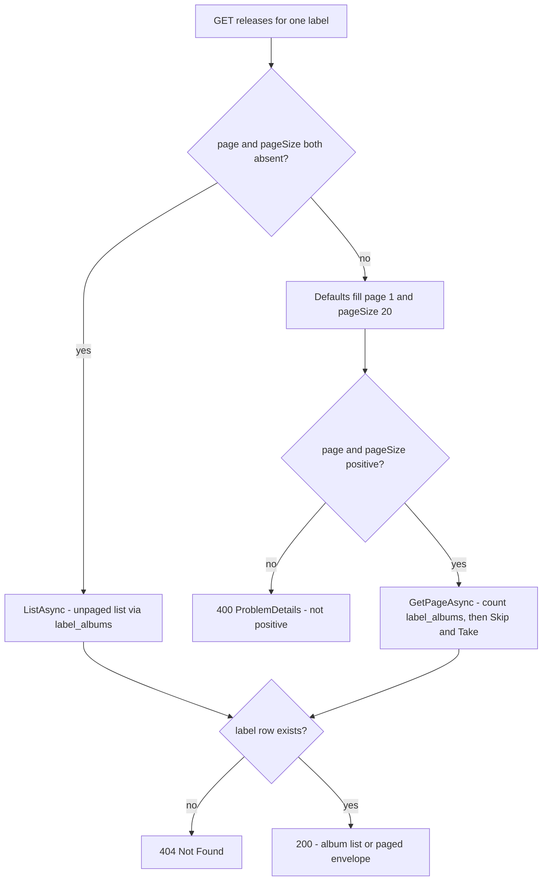

# API Surface and Persistence

`Katalog.Api` (`apps/katalog-api/src/Katalog.Api`) is a single .NET 10 minimal-API
project. HTTP concerns live in `Api/Endpoints`, `Api/Filters` and
`Api/Validators`; each request is executed by a small feature class under
`Features/` that owns its EF Core work; response shapes are plain records in
`Contracts/Contracts.cs`. Everything is persisted in one PostgreSQL database
(`catalog`) through `KatalogContext` plus explicit entity configurations in
`Infrastructure/Configurations`.

The committed contract is `contracts/katalog-api/openapi.json` (OpenAPI 3.1.1,
`"title": "Katalog.Api | v1"`, `version 1.0.0`), regenerated on every local
`dotnet build` and diffed in CI (`.github/workflows/ci.yml` `contract-drift`
job, forced with `/p:OpenApiGenerateDocuments=true`). Domain semantics of these
endpoints - why labels are app-owned, what the `label_albums` invariants
guarantee - are on the [Domain page](../domain/README.md); this page covers the
wire contract, the read/write paths, and the schema.

## Composition root and request pipeline

`Program.cs` is the only place the layers are wired:

1. A CLI branch runs first: `--migrate` / `--rollback <MigrationName>` builds a
   minimal migration-only host and returns (`DatabaseMigrationRunner`).
2. `AddOpenApiDocumentGenerationSettings()` loads
   `appsettings.OpenApiGeneration.json` **only** when the process is the
   build-time document generator (`GetDocument.Insider`, detected in
   `Infrastructure/OpenApiDocumentGeneration.cs`). That file carries
   placeholder connection strings and credentials, and every other startup step
   that would touch Postgres or Spotify is guarded with the same flag -
   options `ValidateOnStart`, the hosted polling service, and the startup
   migration - so `dotnet build` never needs a live database.
3. `AddKatalogServiceDefaults()` (`apps/shared/Katalog.ServiceDefaults`)
   contributes OpenTelemetry, health checks (`/health` in Development, `/alive`
   always), service discovery for `HttpClient`, and
   `BackgroundServiceExceptionBehavior.StopHost`.
4. `AddProblemDetails()` plus `app.UseExceptionHandler()` give every
   unhandled failure (and framework binding failures) an RFC 7807 body.
5. `AddDatabase(...)` registers `KatalogContext` through Aspire's
   `AddNpgsqlDbContext<KatalogContext>("catalog")`, which also brings the
   connection health check, context pooling, and retry-on-failure. The one
   Katalog-specific line is `options.UseSnakeCaseNamingConvention()`.
6. `AddSpotify(...)` registers the client-credentials token provider plus a
   typed `ISpotifyApiClient` with a custom resilience pipeline
   (`TotalTimeout 300s -> Retry (Retry-After aware) -> CircuitBreaker ->
   AttemptTimeout 15s`); the standard handler is deliberately not used because
   its 30 s total timeout would guillotine Spotify's `Retry-After`.
7. `AddFeatures(...)` registers FluentValidation validators from the assembly and
   the scoped feature handlers, plus `ReleasesPollingService` as a hosted
   service.
8. Endpoint mapping: `MapLabelsEndpoints()`, `MapArtistsEndpoints()`,
   `MapReleasesEndpoints()`, then `MapOpenApi()`.

There is **no authentication/authorization middleware and no CORS
configuration** - the MVP is a single-user app and the SPA calls relative
`/api/*` URLs that the Vite dev proxy forwards to the API
(`web/vite.config.ts`). Anyone exposing the API on its own origin would have to
add both.

After `builder.Build()` the process applies pending migrations in
non-Deployment environments before serving, and the polling worker
independently waits for the schema (`MigrationAwareBackgroundService` polls
`GetPendingMigrationsAsync()` every 15 s inside `ExecuteAsync`, so host startup
is never blocked by a slow migration).

## Endpoint groups

All routes are registered as route groups: `/api/labels` for the label
lifecycle, `/api` for artist search and the release feed.

| Operation id | Route | Success | Errors |
|---|---|---|---|
| `SearchLabels` | `GET /api/labels/search?q&limit` | `200` `LabelSearchResponse` | `400` |
| `ListLabels` | `GET /api/labels` | `200` `LabelSummaryResponse[]` (ordered by name) | - |
| `CreateLabel` | `POST /api/labels` | `201` `LabelSummaryResponse` + `Location: /api/labels/{id}` | `400`, `404`, `409` |
| `GetLabelDetail` | `GET /api/labels/{id}?includeReleases` | `200` `LabelDetailResponse` | `404` |
| `UpdateLabel` | `PUT /api/labels/{id}` | `200` `LabelSummaryResponse` | `400`, `404`, `409`, `503` |
| `DeleteLabel` | `DELETE /api/labels/{id}` | `204` | `404` |
| `AddArtistToLabel` | `POST /api/labels/{labelId}/artists` | `200` `ArtistSummaryResponse` | `400`, `404` |
| `RemoveArtistFromLabel` | `DELETE /api/labels/{labelId}/artists/{artistId}` | `204` | `404`, `409` |
| `SearchArtists` | `GET /api/search?q&type&limit` | `200` `ArtistSearchResult[]` | `400` |
| `GetLabelReleases` | `GET /api/labels/{labelId}/releases?page&pageSize` | `200` `AlbumResponse[]` **or** `LabelReleasesResponse` | `400`, `404` |

Path segments are constrained (`:guid`), so a malformed id never reaches a
handler - routing returns `404` instead of a handler-level `400`.

Two contract details are easy to trip over. Search endpoints bind
`[AsParameters]` classes with CLR property names, so the committed contract
declares the query parameters as `Q`, `Type` and `Limit` (capitalized), while
the releases endpoint binds method parameters and therefore publishes lowercase
`page`/`pageSize`. Query-string binding is case-insensitive, so `?q=` and `?Q=`
both work; clients generated from the contract will use the capitalized form.
`limit` is validated against `SpotifyOptions.SearchLimitMax` (10) and defaults
to `SearchLimitDefault` (10) when omitted, which mirrors Spotify's own search
ceiling.

## The dual-mode releases endpoint

`GET /api/labels/{labelId}/releases` keeps one route for two response shapes so
older clients keep working: with neither paging parameter present it returns the
whole `AlbumResponse[]`; with `page` and/or `pageSize` present it returns the
`LabelReleasesResponse` envelope (`page`, `pageSize`, `totalCount`, `hasMore`,
`releases`).



Semantics that clients depend on:

- Sending only one of the two parameters still activates paged mode; the other
  falls back to `page = 1` / `pageSize = 20`.
- `page < 1` or `pageSize < 1` is rejected with `400` and a `ProblemDetails`
  body titled "Page and pageSize must be positive." Non-numeric values fail
  minimal-API model binding and surface as `400` through the exception handler.
- An unknown label id yields `404` in **both** modes: the handler asks
  `context.Labels.AnyAsync(...)` first and the feature returns `null`, which the
  handler maps to `TypedResults.NotFound()`.
- The check runs before the data query, so a 404 costs one cheap existence
  query rather than a scan.

The frontend uses this deliberately: `web/src/views/LabelDetailView.vue` fetches
`api.getLabel(id, false)` and `api.getLabelReleases(id, 1, 5)` in parallel and
appends further pages on demand, while the no-parameter mode remains available
for older clients (and is what the label-detail response embeds when
`includeReleases` is on).

## How a release page is read

`GetLabelReleases` (`Features/Releases/GetLabelReleases.cs`) is the only reader
of releases, and both modes share one query builder:

```
context.Albums
    .Include(a => a.AlbumArtists).ThenInclude(aa => aa.Artist)
    .Where(a => a.LabelAlbums.Any(la => la.LabelId == labelId))
    .OrderByDescending(a => a.ReleaseDate ?? DateOnly.MinValue)
```

- **Membership is read through the junction.** The filter uses
  `LabelAlbums.Any(...)`, never the denormalized `albums.label_id`.
- **Newest first, unknown dates last.** `ReleaseDate` is nullable, and Postgres
  sorts `NULL` first under `DESC`, so the ordering coalesces to
  `DateOnly.MinValue` and unknown dates sink to the bottom. Coarser precisions
  need no special handling because `ReleasePoller.ParseReleaseDate` already
  normalizes `2024`, `2024-05` to the first day of the period at ingest.
- **Paging happens in the database.** `GetPageAsync` runs
  `context.LabelAlbums.CountAsync(la => la.LabelId == labelId)` for
  `totalCount`, then applies `Skip((page - 1) * pageSize).Take(pageSize)` on
  the ordered query. Because `label_albums`' primary key is
  `(label_id, album_id)`, the row count equals the number of distinct albums the
  page query can return, so `totalCount` and the page contents stay consistent.
- **`hasMore` is derived arithmetically**: `page * pageSize < totalCount`. A
  page past the end returns an empty `releases` array with `hasMore = false`
  rather than an error.
- **No Spotify calls per page.** Every row is already persisted by the poller;
  paging is a pure database read.
- **Row mapping** (`MapRows`) formats the `DateOnly` as `yyyy-MM-dd` (or
  `null`), maps the int-backed enums to their Spotify strings
  (`album`/`single`/`compilation`, `year`/`month`/`day`, defaulting to
  `album`/`day` for unknown values), and derives `artistNames` from the
  included `AlbumArtists` as distinct names ordered alphabetically.

Because new releases are inserted at the top of the list by the background
poller, two successive page fetches can overlap; the SPA absorbs that by merging
pages keyed on album id (`web/src/utils/paging.ts` `mergeReleasePages`, covered
by `web/src/utils/paging.test.ts`).

## Label detail and the counters

`GetLabels.GetDetailAsync` backs `GET /api/labels/{id}`. `includeReleases`
defaults to **true** (`includeReleases ?? true` in `LabelsEndpoints`):

- The counters are always computed in the single `labels` projection -
  `artistCount` from `LabelArtists.Count`, `releaseCount` from
  `LabelAlbums.Count` - so both stay accurate when releases are omitted.
- With `includeReleases=true` the handler additionally calls
  `GetLabelReleases.ListAsync` (the unpaged mode) and grafts the result onto the
  projection with `detail with { Releases = releases }`; the `Releases` member is
  passed as `null!` inside the SQL projection so EF never tries to translate it.
- With `includeReleases=false` the release list is an empty array and the
  request is a single query. This is the mode the paged frontend uses, and
  `LabelReleasesPagingIntegrationTests` pins both the shape and the counters.
- An unknown label id returns `404` (the release lookup returns `null` and the
  label projection is `null`).

`ListLabels` uses the same pattern one level up: `LabelSummaryResponse` carries
`spotifyIds` (ordered by artist name) and `artistCount`, but no `releaseCount`.

## Validation and error semantics

Request validation is FluentValidation plus one endpoint filter,
`ValidationFilter<T>`: it picks the argument of type `T` out of the endpoint's
bound arguments, resolves `IValidator<T>` from request services, and returns
`TypedResults.ValidationProblem(...)` (`400` with a `errors` dictionary) when
the result is invalid. It is fail-open by design - a missing validator or a
non-matching argument passes the request through - so validators are registered
assembly-wide by `AddValidatorsFromAssembly` in `FeaturesSetup`, and adding a
validated body without attaching the filter silently skips validation.

| Endpoint | Validator | Rules |
|---|---|---|
| `POST /api/labels` | `CreateLabelValidator` | name non-empty, <= 100 chars, contains a letter/digit (an all-symbol name would produce an empty slug); `spotifyIds` non-null, non-empty, no ordinal duplicates, each matching `^[A-Za-z0-9]{6,64}$` |
| `PUT /api/labels/{id}` | `UpdateLabelValidator` | same name rules |
| `POST /api/labels/{labelId}/artists` | `AddArtistToLabelValidator` | `spotifyArtistId` non-empty, `^[A-Za-z0-9]{6,64}$` |
| `GET /api/labels/search` | `SearchLabelsValidator` | `q` present, not blank, <= 200 chars; `limit` in `1..10` |
| `GET /api/search` | `SearchArtistsValidator` | `q` present, <= 200 chars; `type` empty or exactly `artist`; `limit` in `1..10` |
| `GET /api/labels/{id}/releases` | none (inline) | `page`/`pageSize` positivity checked in the handler, `400` + `ProblemDetails` |

`GET /api/labels/{id}` has no validator either: `includeReleases` is a nullable
`bool?` that simply defaults.

Status codes carry distinct, tested meaning:

- **`404`** - unknown label (`ListLabels` aside), unknown Spotify artist on
  `POST .../artists` and on `POST /api/labels` (any unknown id rolls the whole
  create transaction back, so nothing is persisted), unknown artist-label link
  on `DELETE .../artists/{artistId}`, and an unknown label on the releases
  route.
- **`409`** - a slug collision (`ix_labels_slug`) detected either by a
  pre-check or by catching Npgsql `23505` on constraint `ix_labels_slug`, and
  the "a label must keep at least one artist" refusal when unlinking the last
  artist. Both return a `ProblemDetails` body with a `Title`.
- **`503`** - only from `PUT /api/labels/{id}`: the rename-time link audit
  could not verify every existing link with Spotify, so the transaction is
  discarded and the label keeps its old name and links (see the
  [Domain page](../domain/README.md) for the audit contract).
- **`400`** - validation problems and non-positive paging values.
- **`500`/unmapped** - handled globally by `UseExceptionHandler()` +
  `AddProblemDetails()`.

Because the same poller runs behind a rename, a `PUT` whose normalized name is
unchanged skips the audit entirely and therefore succeeds even when Spotify is
unreachable - worth knowing when interpreting `503`.

## Persistence model

`KatalogContext` exposes one `DbSet` per aggregate (`Labels`, `Artists`,
`Albums`, `LabelArtists`, `LabelAlbums`, `AlbumArtists`, `PollCursors`) and
applies every `IEntityTypeConfiguration` from the assembly in
`OnModelCreating`. The `LabelArtist` set maps to the table **`artist_label`**
(singular, different from the property name), which surprises readers coming
from the other junctions.

```mermaid
erDiagram
    labels {
        uuid id PK
        varchar name
        varchar slug UK
        timestamptz created_at_utc
        timestamptz updated_at_utc
    }
    artists {
        uuid id PK
        varchar spotify_id UK
        varchar name
        text_array genres
        integer popularity
    }
    albums {
        uuid id PK
        varchar spotify_id UK
        varchar name
        integer album_type
        date release_date
        integer release_date_precision
        varchar label_spotify
        uuid label_id FK
    }
    artist_label {
        uuid label_id PK, FK
        uuid artist_id PK, FK
        integer provenance
        timestamptz first_seen_at_utc
        timestamptz last_confirmed_at_utc
    }
    label_albums {
        uuid label_id PK, FK
        uuid album_id PK, FK
        timestamptz first_seen_at_utc
        timestamptz last_confirmed_at_utc
    }
    album_artists {
        uuid album_id PK, FK
        uuid artist_id PK, FK
        integer position
    }
    poll_cursors {
        varchar job_name PK
        timestamptz cursor_value
        timestamptz last_run_at
        varchar status
    }
    labels ||--o{ artist_label : links artists
    artists ||--o{ artist_label : is linked by
    labels ||--o{ label_albums : owns releases
    albums ||--o{ label_albums : belongs to
    albums ||--o{ album_artists : credits
    artists ||--o{ album_artists : credited on
    labels o|--o{ albums : denormalized label_id
```

ER view of the seven mapped tables: `label_albums` is the authoritative
label-to-release membership, and `albums.label_id` is a separate, nullable
denormalized pointer.

### Conventions encoded in the configurations

- **snake_case identifiers.** Column names come from
  `UseSnakeCaseNamingConvention()`; table names are stated explicitly
  (`builder.ToTable("labels")`, `"artists"`, `"albums"`, `"artist_label"`,
  `"label_albums"`, `"album_artists"`, `"poll_cursors"`). Indexes are
  `ix_labels_slug`, `ix_artists_spotify_id`, `ix_albums_spotify_id`,
  `ix_albums_label_id`, plus the FK-side indexes the model adds.
- **No JSON columns.** Multi-valued data uses real relations or Postgres arrays:
  `album_artists` replaces the jsonb proposal from research, and
  `artists.genres` is a `text[]` (a native array column, not JSON).
- **Enums as `int` with gaps** so future values can be inserted without
  renumbering: `AlbumType` (`Album=10`, `Single=20`, `Compilation=30`),
  `ReleaseDatePrecision` (`Year=10`, `Month=20`, `Day=30`),
  `Provenance` (`Manual=10`, `AlbumMetadata=20`). `Album.AlbumType` and
  `Album.ReleaseDatePrecision` and `LabelArtist.Provenance` are configured with
  `HasConversion<int>()`; the API maps them back to Spotify's strings in
  `GetLabelReleases.MapAlbumType`/`MapPrecision`.
- **UUIDv7 keys.** `Id` is `ValueGeneratedNever()` with
  `HasDefaultValueSql("uuidv7()")`: the app generates ids with
  `Guid.CreateVersion7()` (labels, artists, and album inserts that EF owns) and
  the database default still covers raw SQL that omits the column.
- **Natural Spotify keys are unique.** `artists.spotify_id` and
  `albums.spotify_id` carry unique indexes; they are the `ON CONFLICT` targets
  of the poller's upserts. `labels.slug` is unique and is the constraint the
  create/rename paths translate into `409`.
- **Lengths and column types.** `labels.name`/`slug` <= 100, `artists.name`
  <= 255, `albums.name` <= 512, `spotify_id` <= 64, `albums.label_spotify`
  <= 255, image/external URLs <= 2048, `poll_cursors.job_name` <= 100 and
  `status` <= 50. Dates: `albums.release_date` is a Postgres `date`;
  every timestamp column is `timestamptz`.
- **Delete behavior.** `label_albums`, `artist_label` and `album_artists` rows
  cascade with their parent label/artist/album; `albums.label_id` is
  `DeleteBehavior.SetNull`, so unfollowing a label (or deleting one) keeps the
  album rows but nulls the denormalized pointer. `DeleteLabel` therefore removes
  the follow and all its links while leaving artists and albums in the database -
  which is why unlinking the last artist is refused and deleting the label is
  the only way to end a follow.

### `label_albums` versus `albums.label_id`

`albums.label_id` records "the app-owned label this album was last discovered or
verified for" - written on the poller's upsert. It is denormalized, nullable,
indexed, and set to `NULL` when the label disappears. Release reads, release
counts, and the paged total all go through `label_albums` only, so a stale
`albums.label_id` can never leak into a feed. The poller maintains the junction
with the exact-match rules described on the
[Domain page](../domain/README.md).

## Write path: raw-SQL upserts on the shared connection

`ReleasePoller` is deliberately not EF-tracked. It opens a command on the
context's connection and binds it to the ambient EF transaction
(`PrepareCommandAsync`), so its writes commit or roll back together with a
caller's explicit transaction - that is what makes the rename audit
atomic. Its statements:

- `albums`: `INSERT ... ON CONFLICT (spotify_id) DO UPDATE ... RETURNING id`
  (attribution `label_spotify` is the album's real, verified label).
- `artists`: same shape on `spotify_id`, name only - full artist metadata is
  refreshed by the manual `POST .../artists` path instead.
- `album_artists`: `ON CONFLICT (album_id, artist_id) DO UPDATE SET position`,
  followed by a delete of any artist no longer credited.
- `label_albums`: a single guarded statement that re-reads the label's
  **committed current name** under `FOR KEY SHARE` and only inserts when
  `trim(lower(l.name)) = trim(lower(@spotifyLabel))`; on conflict it refreshes
  `last_confirmed_at_utc`. Deleting a link happens only after a positively
  verified mismatch, never on a transient search miss.

`AddArtistToLabel` and `CreateLabel` take the ordinary EF path instead
(`context.Artists` / `context.LabelArtists` with change tracking), and
`CreateLabel` additionally resolves `ReleasePoller` in a **separate DI scope**
after committing, so a polling failure cannot corrupt the request's context and
never rolls the label back.

## Schema evolution and operational entry points

- **Migrations** live in `Infrastructure/Migrations`: `20260922141753_InitialSchema`
  (artists, labels, poll_cursors, albums, `artist_label`, `album_artists`, all
  indexes) and `20260928233935_AddLabelAlbumsJunction` (adds `label_albums`
  with cascading FKs and the `ix_label_albums_album_id` index). The
  authoritative current shape is `KatalogContextModelSnapshot.cs`.
- **CLI mode**: `dotnet Katalog.Api.dll --migrate` applies pending migrations,
  `--rollback <MigrationName>` (`0` reverts all) rolls back; both return a
  process exit code and read the connection string straight from
  `ConnectionStrings:catalog`.
- **Startup migration** runs for non-Staging/non-Production environments with a
  bounded retry (5 attempts, 1-4 s backoff) that absorbs the Aspire
  DCP endpoint proxy's cold-start connection rejections. In Deployment
  environments migrations are an operator step, which is why the worker waits
  for them separately.
- **Design time**: `KatalogContextFactory` (`IDesignTimeDbContextFactory`)
  lets `dotnet ef` build the context from
  `KATALOG_DESIGN_TIME_CONNECTION` or a localhost default, without booting the
  Aspire-wired app.
- **Tests** reset state with `TRUNCATE TABLE album_artists, label_albums,
  artist_label, albums, artists, labels, poll_cursors` against a
  `postgres:18.3` Testcontainers fixture, so a new table must be added to that
  list to keep integration tests isolated.

## Focused tests

- `apps/katalog-api/tests/Katalog.Api.Tests/Integration/LabelReleasesPagingIntegrationTests.cs`
  - pages 1-4 of 10 seeded releases with `totalCount`/`hasMore`, an
  empty beyond-the-end page 5, `400` for `page=0` and `pageSize=0`, the
  no-parameter full-list mode, and both `includeReleases` variants (counters
  preserved with an empty release list).
- `.../LabelsApiIntegrationTests.cs` - the label lifecycle end to end
  (`201` + `Location`, `409` on duplicate slug, `503` rename rollback that
  keeps name and links, `404` on unknown Spotify id with nothing persisted,
  last-artist `409`, search `400`s above Spotify's limit cap, fuzzy
  near-miss label exclusion, stale pre-rename poll snapshot not re-linking).
- `.../ReleasesPollingIntegrationTests.cs` - idempotent upsert + cursor
  advance, `Retry-After` handling, pagination of the label search, exact-label
  verification, and self-healing of a pre-existing contaminated link.
- `KatalogApiFactory` points `ConnectionStrings:catalog` at the container and
  Spotify at WireMock, and removes all `IHostedService`s so the suite drives
  `ReleasePoller` itself; a `Polling:Interval` of `12:00:00` keeps the knob
  inside the validated 6-24 h range.

## See also

- [Architecture overview](README.md) - how the SPA, API, Postgres, and AppHost
  fit together, and the paged-releases path end to end.
- [Domain](../domain/README.md) - label-following model, exact-match
  verification, and the `label_albums` invariants behind these endpoints.
- [Testing](../testing/README.md) - the backend verification layers.
- [Operations](../operations/README.md) - credentials, the reset-database
  action, and health endpoints.
