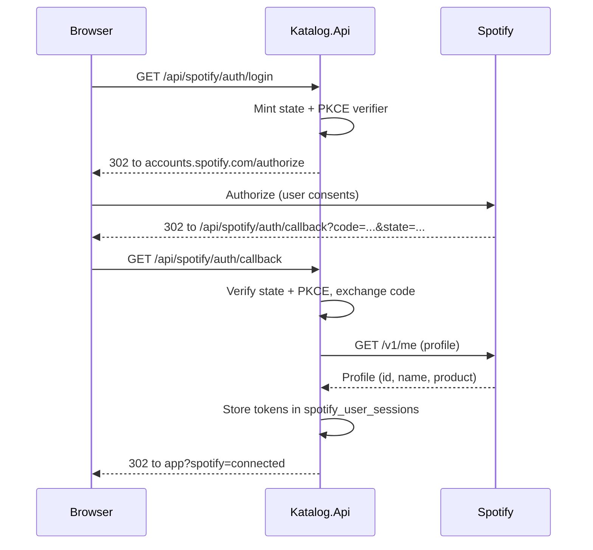

# Katalog - Backend API

## Overview

`Katalog.Api` is a .NET 10 minimal API that serves the Katalog Vue SPA. It is organized
around **vertical slices**: each feature (label CRUD, artist search, release listing, Spotify
Connect) owns its endpoint mapping, request handler, and data access in one folder under
`Features/`, rather than being split into separate controller/service/repository layers.
The API talks to PostgreSQL via EF Core 10 + Npgsql and to the Spotify Web API through two
distinct authentication paths (app client credentials for catalog data, user OAuth for
Connect playback). A committed OpenAPI contract at `contracts/katalog-api/openapi.json` is
generated at build time and mirrors the endpoint surface.

## Program.cs setup pipeline

`Program.cs` is the single composition root. It runs in three modes:

1. **Migration CLI mode** — when `args` contains `--migrate` or `--rollback`, the app builds a
   minimal `WebApplicationBuilder` (content root set to the executable directory so
   `appsettings.*.json` is found), registers only the DbContext, and runs
   `DatabaseMigrationRunner.RunAsync`. This is used at deploy time and manually; it never
   starts the web host.
2. **Build-time OpenAPI generation mode** — when the entry assembly is `GetDocument.Insider`
   (launched by `Microsoft.Extensions.ApiDescription.Server` during `dotnet build`), placeholder
   settings from `appsettings.OpenApiGeneration.json` are loaded and every setup that touches
   external systems or eagerly validates options is skipped via
   `OpenApiDocumentGeneration.IsActive`.
3. **Normal web mode** — the full pipeline below.

The normal-mode registration order in `Program.cs` is:

| Step | Call | Purpose |
|------|------|---------|
| 1 | `AddOpenApiDocumentGenerationSettings()` | Loads placeholder config when generating OpenAPI at build time |
| 2 | `AddKatalogServiceDefaults()` | OpenTelemetry, health checks, service discovery, `StopHost` background-service behavior |
| 3 | `AddProblemDetails()` | RFC 7807 problem details for errors |
| 4 | `AddKatalogOptions()` | Binds + validates `SpotifyOptions` and `PollingOptions` with `ValidateOnStart` |
| 5 | `AddDatabase()` | EF Core context via Aspire's `AddNpgsqlDbContext` (connection name `"catalog"`) |
| 6 | `AddSpotify()` | Token providers, delegating handlers, typed catalog + Connect `HttpClient`s with custom resilience |
| 7 | `AddFeatures()` | Vertical slice handlers, FluentValidation validators, hosted `ReleasesPollingService` |
| 8 | `AddOpenApi()` | Build-time generated OpenAPI document |

After `builder.Build()`, the app applies pending migrations at startup (non-deployment
environments only), then maps endpoints: `MapKatalogDefaultEndpoints()` (health), `MapOpenApi()`,
`MapLabelsEndpoints()`, `MapArtistsEndpoints()`, `MapReleasesEndpoints()`,
`MapSpotifyEndpoints()`.

## Endpoint groups

All endpoints carry `WithName(...)` so the committed OpenAPI contract has stable
`operationId`s. Four route groups are mapped:

### Labels (`/api/labels`)

Mapped by `LabelsEndpoints.MapLabelsEndpoints`. Eight endpoints:

| Method | Path | OperationId | Notes |
|--------|------|-------------|-------|
| GET | `/api/labels/search` | `SearchLabels` | Label search via Spotify's `label:"..."` album filter |
| GET | `/api/labels` | `ListLabels` | All followed labels, ordered by name |
| POST | `/api/labels` | `CreateLabel` | Creates label + links artists; triggers immediate release poll |
| GET | `/api/labels/{id}` | `GetLabelDetail` | Label detail with artists and releases |
| PUT | `/api/labels/{id}` | `UpdateLabel` | Rename; audits existing links in the same transaction |
| DELETE | `/api/labels/{id}` | `DeleteLabel` | Deletes the label (cascades to junction rows) |
| POST | `/api/labels/{labelId}/artists` | `AddArtistToLabel` | Links a Spotify artist to a label |
| DELETE | `/api/labels/{labelId}/artists/{artistId}` | `RemoveArtistFromLabel` | Unlinks; refuses to remove the last artist |

### Artists (`/api/search`)

Mapped by `ArtistsEndpoints.MapArtistsEndpoints`. A single endpoint:

- `GET /api/search?q=...&type=artist&limit=...` (`SearchArtists`) — proxies Spotify's search
  endpoint. The `type` parameter is validated to be `"artist"` only.

### Releases (`/api/labels/{id}/releases`)

Mapped by `ReleasesEndpoints.MapReleasesEndpoints`. A single endpoint:

- `GET /api/labels/{labelId}/releases` (`GetLabelReleases`) — releases for all artists under a
  label, newest first. Returns 404 when the label does not exist.

### Spotify Connect (`/api/spotify`)

Mapped by `SpotifyEndpoints.MapSpotifyEndpoints`. Eight endpoints that run with the signed-in
user's own token (kept server-side), unlike the catalog endpoints which use the app's client
credentials:

| Method | Path | OperationId | Notes |
|--------|------|-------------|-------|
| GET | `/api/spotify/me` | `GetSpotifySession` | Whether an account is connected; no tokens |
| GET | `/api/spotify/auth/login` | `StartSpotifyLogin` | 302 to `accounts.spotify.com/authorize` |
| GET | `/api/spotify/auth/callback` | `CompleteSpotifyLogin` | Exchanges code, stores tokens, redirects back to app |
| POST | `/api/spotify/auth/logout` | `LogoutSpotify` | Deletes the stored session; 204 either way |
| GET | `/api/spotify/devices` | `GetSpotifyDevices` | User's Connect devices with active one flagged |
| GET | `/api/spotify/playback` | `GetSpotifyPlaybackState` | Current playback state for the play/pause toggle |
| PUT | `/api/spotify/playback/play` | `PlayReleaseOnDevice` | Play a release on the chosen device |
| PUT | `/api/spotify/playback/pause` | `PausePlaybackOnDevice` | Pause on the chosen device |

A blank `deviceId` on play/pause means "Spotify's active device" (normalized to `null`).

## Vertical slice features

Each feature is a scoped class registered in `FeaturesSetup.AddFeatures`. The endpoint
methods are thin adapters that translate HTTP shapes into feature calls and map the returned
outcomes/status enums to `TypedResults`.

### Labels features

- **`CreateLabel`** — creates a `Label` row (with a slug derived from the name via
  `LabelSlug.From`), then links each Spotify artist by calling `AddArtistToLabel.AddAsync`
  inside the same transaction. Any unknown Spotify id rolls the whole transaction back and
  returns `ArtistNotFound`. A duplicate slug (unique index `ix_labels_slug`) returns
  `SlugConflict`. On success, it immediately polls releases for the new label in its own
  scope so releases appear without waiting for the next scheduled cycle.
- **`UpdateLabel`** — renames a label and re-derives its slug. When the name changes, it
  calls `ReleasePoller.AuditLabelLinksAsync` inside the same transaction to re-verify every
  existing `label_albums` link against the new name. If Spotify cannot verify any link, the
  whole rename rolls back and returns `RenameVerificationFailed` (the endpoint maps this to
  503). A duplicate slug returns `SlugConflict` (409).
- **`GetLabels`** — lists all labels ordered by name with their artist Spotify ids.
- **`DeleteLabel`** — removes a label; cascades to `artist_label` and `label_albums` rows.
- **`AddArtistToLabel`** — mirrors a Spotify artist (upserted on `spotify_id`) and creates
  or refreshes the `artist_label` junction row with `Provenance.Manual`. Returns null when
  the label does not exist or Spotify does not know the artist.
- **`RemoveArtistFromLabel`** — removes the artist-label link. Refuses to remove the label's
  last artist (`LastArtistRefused` → 409) because polling and the release feed are
  artist-driven.
- **`SearchLabels`** — searches Spotify albums via the `label:"<name>"` filter and returns
  the searched term as a single label hit with the matching albums (Spotify has no label
  resource).

### Artists features

- **`SearchArtists`** — proxies Spotify's `GET /v1/search?type=artist` and maps the response
  to `ArtistSearchResult` records.

### Releases features

- **`GetLabelReleases`** — returns releases for a label via the `label_albums` junction
  table, newest first (null release dates coalesced to `DateOnly.MinValue` so they sort
  last). Album type and release-date precision are mapped from int enums to strings
  client-side (EF cannot translate arbitrary C# switches).

### Spotify Connect features

- **`StartSpotifyLogin`** — mints a CSRF state + PKCE verifier (S256), stores them in a
  short-lived HttpOnly cookie via `BrowserSession`, and returns the
  `accounts.spotify.com/authorize` URL.
- **`CompleteSpotifyLogin`** — proves the callback belongs to this browser's sign-in
  (state match via constant-time comparison + PKCE verifier from the cookie), exchanges the
  code, reads the profile, and stores the tokens server-side. Redirects the browser back to
  the app with `?spotify=connected` or `?spotify=failed&reason=...`. Never returns tokens to
  the browser.
- **`GetSpotifySession`** — reports whether an account is connected and who it is (id,
  display name, product). Deliberately reports no tokens.
- **`GetSpotifyDevices`** — lists the user's Connect devices with the active one flagged and
  restricted devices marked.
- **`ControlSpotifyPlayback`** — plays an album as the playback context on the chosen
  device, pauses, and reads the current playback state. A 204 from Spotify (nothing playing)
  is mapped to a stopped state.

## Validation

FluentValidation validators are registered assembly-wide by
`AddValidatorsFromAssembly` in `FeaturesSetup`. Request DTOs are validated by a generic
`ValidationFilter<T>` endpoint filter that resolves `IValidator<T>` from DI per request and
returns a 400 `ValidationProblem` on failure. The filter is applied per-endpoint via
`.AddEndpointFilter<ValidationFilter<TRequest>>()`.

Validators and their key rules:

- **`CreateLabelValidator`** — name required, max 100 chars, must contain at least one
  letter or digit (so the slug is never empty); `SpotifyIds` required, non-empty, no
  duplicates, each id must match `^[A-Za-z0-9]{6,64}$`.
- **`UpdateLabelValidator`** — name required, max 100 chars, must contain a letter or digit.
- **`AddArtistToLabelValidator`** — `SpotifyArtistId` required, alphanumeric pattern.
- **`SearchLabelsValidator`** — `q` required, non-blank, max 200 chars; `limit` optional,
  1–10.
- **`SearchArtistsValidator`** — `q` required, max 200 chars; `type` must be empty or
  `"artist"`; `limit` optional, 1–10.
- **`PlayReleaseOnDeviceValidator`** — `SpotifyAlbumId` required, alphanumeric pattern;
  `DeviceId` optional, max 128 chars when present.
- **`PausePlaybackRequestValidator`** — `DeviceId` optional, max 128 chars when present.

## Contract DTOs

All request/response records live in `Contracts/Contracts.cs` and
`Contracts/SpotifyConnectContracts.cs`. They are the single source for both the OpenAPI
document and the TypeScript client generation. Key contracts:

- **Label summaries/details** — `LabelSummaryResponse`, `LabelDetailResponse` (with nested
  `ArtistSummaryResponse` and `AlbumResponse`).
- **Label search** — `LabelSearchResponse` → `LabelSearchResult` → `LabelSearchAlbumResult`
  → `LabelSearchArtistResult`.
- **Artist search** — `ArtistSearchResult`.
- **Releases** — `AlbumResponse` (id, spotifyId, name, albumType, releaseDate,
  releaseDatePrecision, labelSpotify, imageUrl, externalUrl, totalTracks, artistNames).
- **Spotify Connect** — `SpotifySessionResponse`, `SpotifyDeviceResponse`,
  `SpotifyDevicesResponse`, `SpotifyPlaybackStateResponse`, `PlayReleaseOnDeviceRequest`,
  `PausePlaybackRequest`.

## Spotify authentication

Katalog uses two distinct Spotify authentication paths, kept deliberately separate.

### App token (client credentials flow)

Used for all catalog data: label search, artist search, artist lookup, album lookup, and
release polling.

- **`SpotifyTokenProvider`** — caches the token in memory until 60 s before `expires_in`
  expiry. A `SemaphoreSlim` serializes refreshes so concurrent callers only ever trigger one
  token exchange. `ForceRefreshAsync` invalidates the cache and fetches a fresh token.
- **`SpotifyTokenHandler`** — a `DelegatingHandler` that injects the Bearer token into every
  catalog call. On a 401, it performs exactly one forced refresh + retry (only for GET
  requests, since a stream body cannot be replayed).
- The token exchange uses HTTP Basic auth with `client_id:client_secret` against
  `accounts.spotify.com/api/token` with `grant_type=client_credentials`.

### User OAuth (authorization code + PKCE)

Used only for Spotify Connect playback control: sign-in, device listing, play/pause, and
playback state.

- **`BrowserSession`** — identifies the browser by an opaque HttpOnly session cookie
  (`katalog_session`, 30-day lifetime). The OAuth handshake (CSRF state + PKCE verifier)
  rides in a second short-lived HttpOnly cookie (`katalog_oauth`, 10-minute lifetime,
  `SameSite=Lax` so the top-level redirect back from Spotify carries it).
- **`SpotifyUserOAuthService`** — builds the authorize URL (scopes:
  `user-read-playback-state user-modify-playback-state`; no `streaming` scope because the
  Web API cannot stream audio) and exchanges the code with the PKCE verifier.
- **`SpotifyUserSessionStore`** — stores tokens in the `spotify_user_sessions` table, one
  row per Spotify account (unique index on `spotify_user_id`). Signing in again with the
  same account re-points the row at the new session. Tokens never reach the browser.
- **`SpotifyUserTokenProvider`** — supplies the user's access token, renewing it with the
  stored refresh token shortly before expiry. A refresh failure surfaces as
  `SpotifySessionExpiredException`.
- **`SpotifyUserTokenHandler`** — injects the user's Bearer token into every Connect call
  and, on a 401, renews once and retries the same request (buffering the request body so a
  play request can be replayed).

## Resilience pipelines

The standard `AddStandardResilienceHandler` is deliberately **not** used — its default
timeouts (10 s attempt, 30 s total) would guillotine Spotify's `Retry-After` delays. Instead,
the catalog and Connect clients use explicit custom pipelines configured in `SpotifySetup`:

- **Catalog client** (`spotify-catalog-resilience`) — `TotalTimeout (300 s) → Retry (3
  attempts, exponential backoff with jitter, `ShouldRetryAfterHeader = true`) →
  CircuitBreaker (30 s break, 30 s sampling, min throughput 5, 50 % failure ratio) →
  AttemptTimeout (15 s)`. The total timeout is dimensioned so retries honoured via
  `Retry-After` are not guillotined.
- **Connect client** (`spotify-user-connect-resilience`) — `TotalTimeout (30 s) → Retry
  (2 attempts, 1 s exponential backoff with jitter, `ShouldRetryAfterHeader = true`) →
  AttemptTimeout (10 s)`. Shorter because a player command is a fast call the user is
  waiting on.
- Both pipelines use the same transient predicate: 429/5xx/408, transport exceptions, and
  timeouts are transient; user-driven cancellation is not retried.

## Release polling

The `ReleasesPollingService` hosted service polls once at start, then on every
`PeriodicTimer` tick (configurable 6–24 h, default 12 h via `PollingOptions`). It waits
for unapplied EF Core migrations before starting (via `MigrationAwareBackgroundService`,
which polls every 15 s so host startup is never blocked). A failing cycle logs and
continues; unexpected exceptions escape and `StopHost` makes them visible as a restart.

The `ReleasePoller` discovers releases by searching Spotify's `label:"<name>"` album
filter with full pagination, then verifies each candidate against the full album object
(`GET /albums/{id}`) because Spotify's label filter matches fuzzily. Only albums whose
real label exactly (case-insensitive, trimmed) equals the followed label's name are linked
via the `label_albums` junction table. A verified mismatch removes an existing link
(self-heal). A label rename audits all existing links in the same transaction and rolls
back with 503 if Spotify cannot verify any of them.

All poller writes use raw SQL (`INSERT ... ON CONFLICT`) on the shared EF connection,
bound to the caller's transaction when one is active, so poll writes commit or roll back
together with the request's EF changes.

## Database and migrations

- **EF Core 10 + Npgsql** with the `catalog` connection (registered via Aspire's
  `AddNpgsqlDbContext`). The `UseSnakeCaseNamingConvention` plugin maps C# names to
  snake_case tables/columns.
- **Migrations** are applied two ways: at startup in non-deployment environments (with a
  bounded 5-attempt retry loop for cold-start connection issues), and via the `--migrate` /
  `--rollback` CLI mode for deploy-time and manual use.
- **Design-time** `dotnet ef` commands use `KatalogContextFactory`, which reads
  `KATALOG_DESIGN_TIME_CONNECTION` or falls back to a local Postgres connection.
- **Schema** (from migrations): `labels`, `artists`, `albums`, `artist_label`,
  `album_artists`, `label_albums`, `poll_cursors`, `spotify_user_sessions`. Enums are
  stored as int with gaps; junction tables model many-to-many relationships; no JSON columns.

## OpenAPI generation

The committed `contracts/katalog-api/openapi.json` is generated at build time by
`Microsoft.Extensions.ApiDescription.Server` (the `GetDocument.Insider` host). The build
works without a live Postgres or Spotify: `appsettings.OpenApiGeneration.json` supplies
placeholder connections, and setups that touch external systems or eagerly validate
options are guarded with `OpenApiDocumentGeneration.IsActive`. The document is OpenAPI
3.1.1 and carries `operationId`s for all 18 endpoints across the four tags
(`LabelsEndpoints`, `ArtistsEndpoints`, `ReleasesEndpoints`, `SpotifyEndpoints`).
