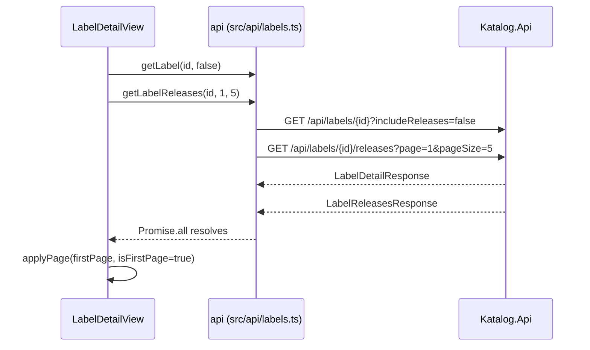
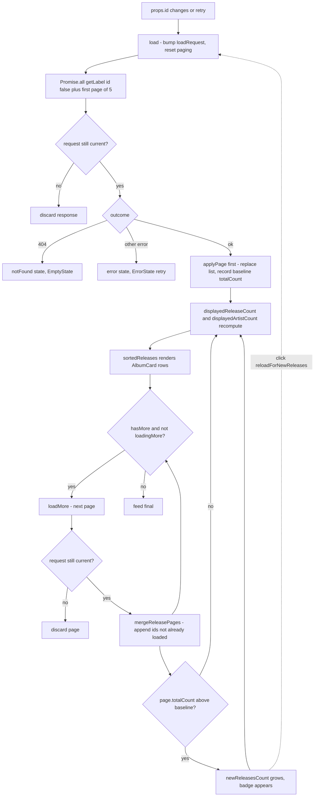

# Frontend Data Path and Paged Release Loading

This page covers the SPA half of the release feed: how `web/` calls the API, how
`LabelDetailView` turns a sequence of paged `GET /api/labels/{id}/releases`
responses into one growing list, and which numbers on screen are derived from
that list rather than from a server counter. The server-side contract those
calls rely on is documented on the
[API and persistence page](api-and-persistence.md); the whole-system picture is
on the [Architecture overview](README.md).

## The typed client boundary

`web/src/api/` is a **handwritten** client that mirrors the committed contract
(`contracts/katalog-api/openapi.json`) and is marked as such by
`API_CLIENT_ORIGIN = 'handwritten'` in `web/src/api/index.ts`. Three files carry
the boundary:

- `web/src/api/http.ts` - one `request<T>` primitive. Every call is
  `fetch('/api' + path, ...)` with `Accept: application/json` and, only when a
  body is present, `Content-Type: application/json`. A non-2xx response is
  parsed as an RFC 7807 problem document and rethrown as an `ApiError` carrying
  `status` and `detail`; `204` resolves to `undefined` without parsing a body.
  Because every path is relative, the Vite dev proxy (`web/vite.config.ts`)
  forwards `/api` to `API_HTTP`/`API_HTTPS` when Aspire injects them, falling
  back to `http://localhost:5192`.
- `web/src/api/labels.ts` - the endpoint surface as one `api` object. Two calls
  matter here: `getLabel(id, includeReleases = true)` appends
  `?includeReleases=false` only when the flag is false, and
  `getLabelReleases(id, page, pageSize)` always sends **both** `page` and
  `pageSize`, which is what puts the backend into its paged response mode.
- `web/src/api/types.ts` - the DTOs, including the paging envelope
  `LabelReleasesPage { page, pageSize, totalCount, hasMore, releases }` and
  `AlbumSummary` (with `artistNames` derived server-side). These are
  hand-maintained, not generated, so they are a mirror rather than a guarantee:
  the backend also sends fields the SPA type does not declare (`slug`,
  `updatedAt`, `labelSpotify`), and the SPA simply ignores them.

Switching to the generated client is a prepared seam rather than a rewrite:
`npm run generate:client` runs `@hey-api/openapi-ts` into `src/api/generated`,
and `web/src/api/README.md` states the rule - keep the `/api` base path and the
`ApiError` shape so views and stores do not have to change. Call sites
(`api.*`, `ApiError.status`) go through `web/src/api/index.ts`, so no view
imports `http.ts` directly.

## Label detail: one load, one page, one state machine

`/labels/:id` is a lazy route named `label-detail` with `props: true`
(`web/src/router.ts`), so `LabelDetailView` receives the id as a prop and runs
`watch(() => props.id, load, { immediate: true })`. Navigating between labels
re-enters `load()` rather than mutating a cached view.

All paging state is **component-local `ref`s in `LabelDetailView.vue`** -
`detail`, `loadedReleases`, `currentPage`, `hasMore`, `totalCount`,
`initialTotalCount`, `newReleasesCount`, plus `loading`/`loadingMore`/
`notFound`/`error`. The Pinia store (`web/src/stores/labels.ts`) holds only the
followed-label summaries; the detail view consults it for the "Following" badge
and for the unfollow mutation, and caches no release data. A consequence worth
knowing: `store.fetchLabels()` is only triggered by `LabelsView`, so a deep link
or a browser reload straight onto a label detail starts with an empty store and
therefore no "Following" badge until the labels list is loaded.

`PAGE_SIZE` is a local constant of `5`. The first load fires two requests
concurrently in one `Promise.all`:

```
api.getLabel(id, false)                    // detail, includeReleases=false
api.getLabelReleases(id, 1, PAGE_SIZE)     // first release page
```

Requesting `includeReleases=false` keeps the detail call a single query - the
releases arrive through the paged endpoint instead, and `detail.releases`
arrives empty and is never read by the view.



Outcome branches, all keyed off a `status` property on the thrown error. The
view duck-types it (`err instanceof Error && 'status' in err`) rather than
testing `instanceof ApiError`, so the `ApiError` shape promised by `http.ts` -
not the class - is the contract a view actually depends on:

- `loading` renders a skeleton block for the whole page.
- `404` sets `notFound` and renders `EmptyState` with a "Back to labels" link -
  this is also what a malformed (non-GUID) id produces, because the backend
  constrains the route segment.
- any other failure sets `error` and renders `ErrorState`, whose `retry` event
  re-invokes `load()`.
- success renders the header, a Releases tab (default) and an Artists tab. The
  Artists tab is fed from `detail.artists` - the full, unpaged list - and falls
  back to an `EmptyState` while the backend has not discovered artists yet.

## Load more, merge, derive

`loadMore()` is guarded on `loadingMore || !hasMore` (so the button is a no-op
while a page is in flight and disappears once the server says `hasMore` is
false), then requests `currentPage + 1` with the same `PAGE_SIZE`. The response
goes to `applyPage(page, false)`, which merges instead of replacing:

- `mergeReleasePages(existing, page)` (`web/src/utils/paging.ts`) appends only
  releases whose `id` is not already loaded, and on a collision **the already
  loaded copy wins**. This matters because the backend orders releases newest
  first and the background poller can insert new albums at the top of the list
  between two page fetches, so page N+1 legitimately repeats rows that page N
  already delivered. Keeping the first copy also keeps rendering stable, since
  the array order is the merge order and the view sorts it anyway.
- `currentPage`, `totalCount` and `hasMore` are overwritten from the envelope
  on every page, so the view always trusts the server's `hasMore`
  (`page * pageSize < totalCount`) rather than counting locally.
- a failed load-more **does not** clear `hasMore` or advance `currentPage`; it
  raises a `vue-sonner` error toast, so the same page can simply be retried.

`sortedReleases` is a computed that copies `loadedReleases` and sorts it
descending by `releaseSortKey(releaseDate, releaseDatePrecision)`
(`web/src/utils/dates.ts`), which normalises `year` and `month` precision to the
first day of the period and maps a missing date to `0000-01-01`. Client-side
sorting matches the backend's `ORDER BY release_date DESC` and keeps
already-loaded pages correctly ordered after a later page merges in.
`AlbumCard` renders each entry with `formatReleaseDate`, which honours the same
precision (`2024`, `Mar 2024`, `4 Mar 2024`, or `Unknown date`).



The diagram shows the whole cycle: load resets and establishes a baseline,
load-more merges by id, the derived counters and the new-releases badge fall out
of the same merge, and clicking the badge re-enters `load()`.

## Counters that count what is on screen

The header shows two numbers next to the label name, and neither is the detail
response's counter:

- `displayedReleaseCount = loadedReleases.length` - exactly the number of album
  cards rendered.
- `displayedArtistCount = countUniqueArtists(loadedReleases)` - the number of
  **distinct artist names** credited across the loaded releases
  (`web/src/utils/paging.ts`). It is a name set, not an artist-id set and not
  the label's linked artists: two different artists sharing a display name
  collapse into one, and an artist linked to the label but absent from the
  loaded pages is not counted.

Both are `computed` from the same array, so they grow monotonically as pages are
revealed, and they are distinct from `LabelDetail.artistCount` /
`LabelDetail.releaseCount`, which the backend still computes accurately but
this view never renders (those fields appear only in `web/src/api/types.ts`).
That is the deliberate design: the header advertises what has been loaded, not
the whole catalogue. A reader comparing the header against the labels list will
see different numbers by design, not by bug.

## The new-releases indicator

`initialTotalCount` is captured from the **first** page's `totalCount` and acts
as the session's baseline. Every later page compares its own `totalCount` with
that baseline; if it has grown, `newReleasesCount` becomes the difference
(`page.totalCount - initialTotalCount`). The badge then reads
`{{ newReleasesCount }} new since you started` and is rendered only while
`newReleasesAvailable` holds:

```
newReleasesCount > 0 && loadedReleases.length < totalCount
```

The second term suppresses the badge once the user has already loaded everything
- the last page's `hasMore` is false and there is nothing left to reveal. The
counter can therefore only become non-zero after a load-more request observes a
grown `totalCount`; the initial page never raises it, and a `totalCount` that
shrinks (impossible in normal operation, since links are only removed by a
verified mismatch) leaves the previous value untouched.

Clicking the badge runs `reloadForNewReleases()`, which calls `resetPaging()`
and then `load()`: a fresh page 1, a fresh `initialTotalCount` baseline, and a
cleared `newReleasesCount`. There is no partial merge for "new only" - the
re-baseline is the whole mechanism, and the old pages are discarded.

## Stale-response guards, and the seam between them

Two independent sequence counters sit in the component (`loadRequest` and
`loadMoreRequest`). `load()` bumps `loadRequest` and drops the response if a
newer `load()` has started; `loadMore()` does the same for `loadMoreRequest`.
This is what makes fast navigation between labels safe on the `load` path, and
is the same defensive style the Pinia store uses with its `fetchId`/`revision`
pair. The counters and the functions live in the same file; only the pure
merge/count helpers were extracted into `web/src/utils/paging.ts`, which is
where the unit tests can reach them.

One sharp edge is worth stating explicitly: the two guards are **not** linked.
`load()` sets `loadingMore` to false and calls `resetPaging()`, but it does not
bump `loadMoreRequest`. A page-N+1 request that was in flight for the previous
label therefore still passes its own guard after a navigation and is merged into
the newly reset list, along with the previous label's `currentPage` and
`hasMore`. Clicking "Ladda mer" and immediately navigating between labels is the
reproducible path. Bumping `loadMoreRequest` in `resetPaging()` (or in `load()`)
closes it, and the pure helpers do not need to change to do so.

## Focused tests

`web/src/utils/paging.test.ts` is the only frontend unit test file. It runs under
`vitest` (`npm test` -> `vitest run`) and covers the two pure helpers, which is
why the view delegates merging to them:

- `mergeReleasePages` - appends a disjoint page; de-duplicates an overlapping
  page; and, on a collision, keeps the already loaded copy (asserting the
  original name and `artistNames` survive).
- `countUniqueArtists` - de-duplicates names across releases, returns `0` for an
  empty list, and returns `1` when every release credits the same artist.

Not covered: the view itself. There is no component test for the counters, the
badge baseline, or the guards. `.github/workflows/web.yml` runs `npm ci`,
`npm run typecheck` and `npm run build` for pull requests against `main` - it
does **not** run `npm test`, so the paging unit tests are not enforced in CI
today. The planned frontend scenarios (fast navigation between label details,
concurrent mutation vs refresh) are tracked on the
[Testing page](../testing/README.md).

## See also

- [Architecture overview](README.md) - the SPA, API, Postgres, and AppHost as a
  whole, and the paged-releases path end to end.
- [API and persistence](api-and-persistence.md) - the dual-mode releases
  endpoint, the paging envelope, `400`/`404` semantics, and the `label_albums`
  read that every page comes from.
- [Domain](../domain/README.md) - why releases are inserted at the top of the
  list, which is what makes consecutive pages overlap.
- [Testing](../testing/README.md) - the verification layers and the planned
  browser scenarios.
