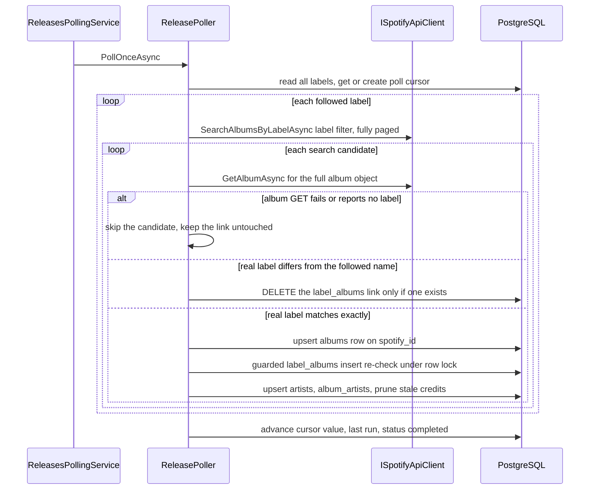

# Release Polling and Label-Release Linking

`ReleasePoller` (`apps/katalog-api/src/Katalog.Api/Features/Releases/Polling/ReleasePoller.cs`)
is the only writer of releases. It is the sole producer of the `label_albums`
rows that `GetLabelReleases` reads for `GET /api/labels/{id}/releases`, so
everything the release feed shows exists because this component decided the album's
real Spotify label exactly equals a followed label's name.

The wire contract and the schema are on the
[API and persistence page](api-and-persistence.md); the business rules are stated
on the [Domain page](../domain/README.md). This page covers the polling
mechanism, the verification invariants, and the link maintenance that make those
rules hold.

## Entry points

| Entrypoint | Caller | Scope | Cursor |
|---|---|---|---|
| `PollOnceAsync` | `ReleasesPollingService` (hosted service), integration tests | scheduled | advanced |
| `PollLabelAsync` | `CreateLabel` after a successful commit | own DI scope | untouched |
| `AuditLabelLinksAsync` | `UpdateLabel` inside its own transaction | caller's transaction | untouched |

`ReleasePoller` is registered `AddScoped<ReleasePoller>()`; the worker is
`AddHostedService<ReleasesPollingService>()` - **only when
`!OpenApiDocumentGeneration.IsActive`**, so the build-time OpenAPI generator
(`GetDocument.Insider`) never starts a poller against the placeholder connection
string. Tests remove all `IHostedService`s and drive `ReleasePoller` directly.

## The scheduled rhythm

`ReleasesPollingService` extends `MigrationAwareBackgroundService<KatalogContext>`
and runs a simple loop:

1. Wait until `GetPendingMigrationsAsync()` is empty. This happens **inside**
   `ExecuteAsync`, so host startup (HTTP serving, `/health`) is never blocked by a
   slow migration or an unreachable database; the worker idles, re-checking every
   15 s and logging a warning when the check itself fails.
2. Poll once directly, then on every `PeriodicTimer` tick. The first poll runs
   before the first tick because `PeriodicTimer` waits a full interval before its
   first one.
3. Each tick opens a **fresh DI scope** and resolves `ReleasePoller`; a failing
   cycle is caught and logged so the next interval retries, while
   `BackgroundServiceExceptionBehavior.StopHost` (from `AddKatalogServiceDefaults`)
   still makes a truly unexpected escaping exception visible as a host restart.

`IOptionsMonitor<PollingOptions>` is read **per execution** of
`ExecuteCoreAsync` (`pollingOptions.CurrentValue.Interval`), so the `PeriodicTimer`
is constructed from the value valid at start. `PollingOptions.Interval` defaults
to **12 h** and is validated to lie in **6-24 h** with `ValidateOnStart`
(skipped in the OpenAPI-generation host, like the Spotify options).

## One poll pass



A single poll pass over every followed label; the per-label loop isolates failures.

- **Discovery uses the `label:"<name>"` search filter**, escaped with
  `EscapeDataString` (so the wire query is `q=label%3A%22<name>%22`), page size
  clamped to `SpotifyOptions.SearchLimitMax` (10), and pagination followed via
  Spotify's `next` URL until exhausted. It is undocumented-but-working against
  real Spotify and is not in the official spec's filter list. `maxItems` is `null`
  here, so a label with more than ten releases is never silently capped (the label
  *search* endpoint passes `maxItems: limit` instead, to save quota).
- **Per-label failure isolation**: each label's search plus all its candidate
  processing is wrapped in `try/catch`; a failure is logged and the pass continues
  with the next label. Only an `OperationCanceledException` caused by the caller's
  token is rethrown. The cycle still finishes "completed" and the cursor still
  advances.
- **The cursor row is the pass's completion record.** `GetOrCreateCursorAsync`
  finds the `poll_cursors` row keyed by `JobName` or adds it; after the loop the
  poller stamps `CursorValue` with the *cycle's start* time, `LastRunAt` with the
  completion time, and `Status = "completed"`.
- **Idempotence is the crash-safety mechanism.** Every write is
  `ON CONFLICT ... DO UPDATE`, so re-running a pass over the same data updates the
  same rows (same album ids) instead of duplicating. That is why a crash
  mid-cycle is harmless: the next pass re-verifies and converges.

`PollLabelAsync` (the immediate poll after a label is followed) runs the same
search and verification for a single label, and deliberately **does not** touch the
cursor - the scheduled job's cursor stays null until the first real cycle. It
swallows and logs failures so a Spotify outage can never roll back a label
creation. `CreateLabel` resolves the poller in a **separate scope** after its own
transaction commits, so a polling failure cannot corrupt the request's DbContext.

### Quota shape

Per candidate the poller spends one search-page request plus **one
`GET /albums/{id}`** verification call. That per-candidate GET is a deliberate
trade-off (one full-album object per candidate) and is what the 6-24 h rhythm and
the Spotify client's `TotalTimeout 300s -> Retry (Retry-After aware) ->
CircuitBreaker -> AttemptTimeout 15s` pipeline exist for; a 429 with a long
`Retry-After` is honoured rather than guillotined.

## Exact-match verification invariants

Spotify's `label:"..."` filter matches **fuzzily** - searching "Globuli" can also
return albums whose real label is "Globulin". A search hit is therefore never
trusted on its own. `VerifyAndUpsertAlbumAsync` re-fetches the **full** album
object (`GET /albums/{id}`, the only shape that carries the `label` field) and
branches on the album's real, trimmed label:

- **No label / GET failure** - the candidate is skipped with an informational log.
  Nothing is written; the next cycle re-fetches and re-verifies. An unverifiable
  candidate is never upserted.
- **Real label does not exactly equal the followed name (case-insensitive,
  trimmed)** - `RemoveVerifiedMismatchedLabelAlbumAsync` runs a `DELETE` on
  `label_albums` for the (label, album) pair. This is the **only deletion path
  during polling**: a link is removed *only* after the album GET positively
  succeeded and reported a different label.
- **Exact match** - the album is upserted, and the stored `label_spotify`
  attribution is the **album's real Spotify label**, not the discovering label's
  name. So attribution always reflects what Spotify itself reports.

## `label_albums` link maintenance

`label_albums` is the authoritative label-to-album relationship (the denormalized
`albums.label_id` is never used for reads). After the album upsert,
`UpsertLabelAlbumAsync` links the release with a single guarded statement:

```sql
INSERT INTO label_albums (label_id, album_id, first_seen_at_utc, last_confirmed_at_utc)
SELECT @labelId, @albumId, now(), now()
FROM labels l
WHERE l.id = @labelId
  AND trim(lower(l.name)) = trim(lower(@spotifyLabel))
FOR KEY SHARE OF l
ON CONFLICT (label_id, album_id) DO UPDATE SET
    last_confirmed_at_utc = now()
```

Two properties fall out of that statement, and they are the concurrency guarantee
of the whole feature:

- **Linking re-reads the label's committed current name under a row lock**
  (`FOR KEY SHARE OF l`). A poll pass that started *before* a rename carries a
  pre-rename snapshot in memory, but the insert still compares against the name
  that is committed *now*. If they differ, zero rows are affected and the link is
  skipped with an "album link skipped" log - so a stale pass can neither link nor
  resurrect an album whose real label matches the old name.
- **Links are add/confirm only here.** An existing link is refreshed
  (`last_confirmed_at_utc`), never removed. A transient search miss (an album that
  simply stopped appearing in results) therefore never deletes a legitimately
  discovered release.

`label_albums` has PK `(label_id, album_id)`, which is why the read path's row
count equals the number of distinct albums a page can return.

The poller's raw SQL runs on the context's own connection via
`PrepareCommandAsync`, which **binds the ambient EF transaction** when one is
active. That is what lets the rename-time audit commit or roll back together with
the caller's EF changes.

## The rename-time link audit

A rename deliberately retargets a label, and discovery will never re-encounter
the old links under the new name. So `UpdateLabel.UpdateAsync` runs
`AuditLabelLinksAsync` **inside the same transaction as the rename** (and only
when the normalized name actually changed - a no-op rename skips the audit and
succeeds even when Spotify is unreachable). For every existing `label_albums` link
of the label the audit re-fetches the full album object and branches:

- **Album GET returns 404** - a verified upstream fact: the album no longer exists
  in Spotify's catalog, so it can never exactly match. The link is removed and the
  rename proceeds.
- **Album GET fails, or reports no label** - unverifiable. The audit throws
  `LabelLinkAuditIncompleteException` and stops.
- **Real label does not exactly match the new name** - the link is unlinked
  (same delete path as a verified mismatch).
- **Exact match** - the album is re-upserted through the normal path, which also
  corrects any stale `label_spotify` attribution to the real label.

`UpdateLabel` catches `LabelLinkAuditIncompleteException` and returns
`UpdateLabelStatus.RenameVerificationFailed`; disposing the transaction rolls back
both the rename and any audit writes, so the label keeps its **old name and all
its links**. The endpoint maps that status to **503 Service Unavailable** with the
title "The label was not renamed." Nothing unverified is ever listed, and a
retryable 503 is the client's signal to try again when Spotify is reachable.

## `JobName` compatibility

`ReleasePoller.JobName = "artist_new_releases"` predates the switch from
artist-discography polling to label-search polling. The name is the
`poll_cursors` primary key, so keeping it avoids a cursor migration. Tests and any
operator looking for "the poller's cursor row" must look it up by this historical
name, not by a label-oriented one.

## Configuration and operational surface

- `Polling:Interval` (TimeSpan, default `12:00:00`, validated 6-24 h) controls the
  `PeriodicTimer` period; it appears in `appsettings.json` and
  `appsettings.OpenApiGeneration.json`. `SpotifyOptions.Market` is the ISO
  3166-1 market sent on every catalog call.
- Both option sections use `ValidateOnStart`, and both are skipped during
  build-time OpenAPI generation, where placeholder settings are loaded instead.
- Observability: cycle completion logs the label count; per-label failures log an
  error; verified mismatches and skipped links log at information; candidate skips
  and per-candidate counts log at debug. Progress is observable through the
  `poll_cursors` row (`status = "completed"`, `last_run_at`).
- The `label_albums` table (and `poll_cursors`) must be part of any test reset /
  `TRUNCATE` that isolates integration tests, since the poller and the rename
  audit write them directly.

## Focused tests

- `apps/katalog-api/tests/Katalog.Api.Tests/Integration/ReleasesPollingIntegrationTests.cs` -
  idempotent upsert with an unchanged album id across two passes plus
  `cursor.Status == "completed"`; `Retry-After` 429 recovery; a failing label
  search that skips only that label while the cursor still advances; full
  pagination of the label search (11 releases across two pages, every candidate
  verified); near-miss exclusion ("Test Labels" vs the followed "Test Label");
  exact match accepted case-insensitively/trimmed with the real label stored as
  `label_spotify`; an unverifiable candidate skipped with the cursor still
  advancing; and a **self-healing** case where a link created under the
  pre-verification regime is unlinked on the next pass while the exact match keeps
  its link and gets its attribution corrected.
- `.../LabelsApiIntegrationTests.cs` - the rename path that the audit protects:
  `UpdateLabel_RenameAuditsLinks_UnlinksVerifiedMismatches_KeepsExactMatches`,
  `UpdateLabel_RenameFailsWith503_KeepingOldNameAndLinks_WhenSpotifyVerificationFails`
  (503, rollback, name and links intact, next poll still correct),
  `UpdateLabel_RenameUnlinks404Album_AndSucceeds`,
  `UpdateLabel_NoOpRename_SkipsAuditAndSucceedsWhenSpotifyUnreachable` (asserts
  zero `/v1/albums/*` calls), and
  `PollPass_WithStalePreRenameName_CannotLinkAlbumWhoseRealLabelIsTheOldName`
  (the `FOR KEY SHARE` guard: a pass whose snapshot predates the rename must not
  re-link after the audit unlinked the album). It also pins
  `CreateLabel_DiscoversReleasesImmediately` (immediate poll) and that the
  immediate poll leaves the cursor null.
- `.../Unit/SlugAndPollingParsingTests.cs` - the ingest normalizers
  `ReleasePoller.ParseAlbumType` and `ParseReleaseDate` (year/month precisions
  normalize to the first day of the period; missing values become `null`).
- `KatalogApiFactory` removes every `IHostedService` (the suite drives the poller
  itself) and pins `Polling:Interval` to `12:00:00` inside the validated range.

## See also

- [API surface and persistence](api-and-persistence.md) - the release read path,
  `label_albums` schema, and the `503` rename contract.
- [Domain](../domain/README.md) - the exact-match and `label_albums` invariants in
  business terms.
- [Architecture overview](README.md) - how the API, SPA, and AppHost fit together.
