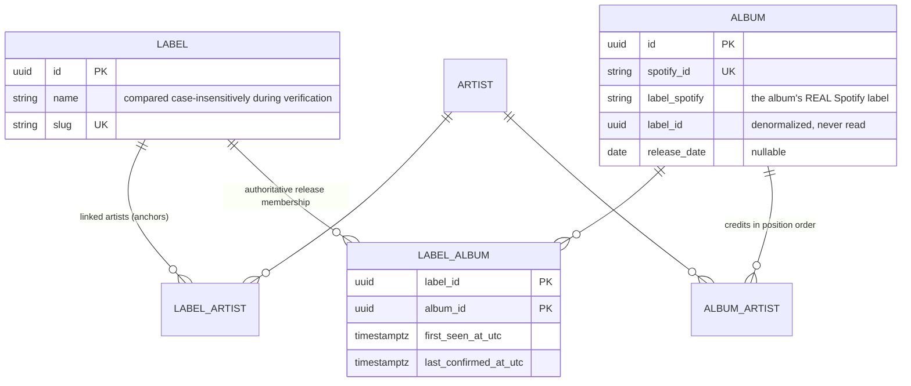
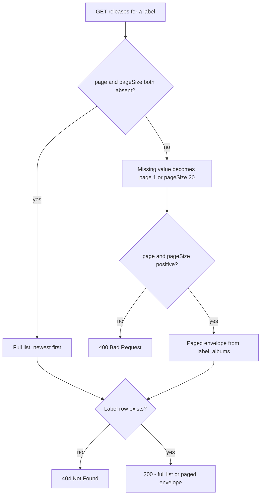

# Katalog - Domain

This page states the **business rules** of Katalog: what a label is, how
releases are attributed to it, what may and may not appear in a release feed,
and what a client may assume about paging and counters. The mechanisms behind
these rules live on the subsystem pages: [API and
persistence](../architecture/api-and-persistence.md) for the wire contract and
schema, [release polling](../architecture/release-polling.md) for the worker and
its link maintenance, and [frontend data
path](../architecture/frontend-data-path.md) for how the SPA consumes them.

## The product

Follow record labels ("labels") via Spotify and see their releases. A single
user adds a label by searching Spotify for it; the app then tracks the artists
behind that label and the albums those releases arrive on.

Decisions recorded with the captain (the repo's own decision record is
`README.md` "Beslut som styr implementationen" and `AGENTS.md`):

- **Single user** - no multi-tenant design, no user accounts, no Spotify user
  OAuth. All catalog data comes from a client-credentials app token, so the
  user's personal Spotify follows and playlists are not part of Katalog.
- **Labels and artist links are app-owned entities.** Spotify's `label` field is
  used as the *source of truth* for whether a release really belongs to a label,
  never as the identity of the label itself.
- **No tracks stored** - albums, artists and labels only; MusicBrainz is deferred
  and reserved as an enrichment fallback.
- **User adds labels manually** via Spotify label search in the add-label dialog.
- **Frontend theme** - shadcn-vue preset `a1AhVxI` (reka-maia).

## Why labels are an app-owned model

Spotify's Web API has **no label entity, no label endpoint, and no way to follow
a label**. The only label metadata is the `label` free-text field, which appears
**only on the full album object** returned by `GET /albums/{id}`; simplified
album objects from artist-discography lists and from album search leave it
`null` (`SpotifyAlbumItem.Label` is documented as populated by the full album
object only).

Therefore "following a label" is modelled as three app-owned facts:

1. A `labels` row created by the user, with a name and a derived unique slug
   (`LabelSlug.From`).
2. Artists linked to that label through the `label_artists` junction. They are
   *anchors*: the add-label dialog derives them by collecting the unique Spotify
   artist ids credited on the label search's album hits, and creates the label
   with them. A followed label must keep at least one artist.
3. A release poller that discovers albums through Spotify's `label:"<name>"`
   album-search filter and upserts them idempotently (`ON CONFLICT (spotify_id)`).

The link the release feed reads is `label_albums`; `albums.label_id` exists but is
never used to answer "does this release belong to this label".

Spotify-side constraints that shape the rules: the app-token (no user OAuth)
model, the search `limit` ceiling of 10 per page (`SpotifyOptions.SearchLimitMax`,
a higher value returns HTTP 400 from Spotify), and a dev-mode quota that is
honoured through the client's `Retry-After`-aware retry pipeline - which is why
polling is a slow scheduled job plus one immediate poll per new label rather
than a per-request Spotify call.

## Exact-match verification and label_albums invariants

Spotify's `label:"..."` search filter matches **fuzzily** - following "Globuli"
also returns albums whose real label is "Globulin" - so the poller never trusts
a search hit. These invariants are what protect the release feed:

- **Verify before linking.** Every candidate album is re-fetched as a full album
  object (`GET /albums/{id}` - one GET per candidate, the captain's explicit
  quota choice). Only albums whose real Spotify `label` **exactly (ordinal
  case-insensitive, trimmed) equals the followed label's current name** are
  upserted, and the stored `label_spotify` attribution is the album's real label,
  not the discovering label's name.
- **A candidate that cannot be verified is skipped, not deleted.** If the album
  GET fails or the album reports no label, the candidate is skipped and the next
  pass re-verifies it. An unverifiable candidate is never upserted, and a
  transient search miss never removes a link.
- **Verified mismatch self-heals.** If verification positively reports a real
  label that is not an exact match, any existing `label_albums` link is removed.
  This verified-mismatch path (plus the rename-time audit) is the **only** place
  a junction row is ever deleted, so links written before exact verification
  existed converge away on the next poll pass.
- **Linking is guarded against renames.** The junction insert re-reads the
  label's *committed* current name under a row lock (`FOR KEY SHARE`) inside one
  atomic SQL statement. A poll pass holding a pre-rename snapshot in memory can
  therefore never link an album whose real label no longer matches the renamed
  label; the statement affects zero rows and the link is skipped.
- **A rename audits all links.** A rename deliberately retargets the label, so
  `UpdateLabel` runs `ReleasePoller.AuditLabelLinksAsync` inside the same
  transaction, and only when the trimmed name actually changed. Per existing
  link: exact matches are re-upserted (correcting stale `label_spotify`
  attribution), verified mismatches and Spotify-404 albums are unlinked, and any
  link Spotify cannot verify (GET failure, 5xx/429, cancellation, or no label
  reported) throws `LabelLinkAuditIncompleteException`. That exception rolls the
  whole transaction back - the label keeps its old name and all its links - and
  the API returns **503 Service Unavailable** so the rename can be retried when
  Spotify is reachable. Nothing unverified is ever listed.
- **Cursor name kept for compatibility.** `ReleasePoller.JobName` remains
  `'artist_new_releases'` even though polling is label-search based: the constant
  is the `poll_cursors` primary key, and keeping it avoids a cursor migration.

The poll runs on a configurable rhythm (6-24 h, default 12 h, poll once at
startup then on a `PeriodicTimer`) via `ReleasesPollingService`, and
`CreateLabel` triggers an immediate `PollLabelAsync` after it commits - in its
own DI scope, so a Spotify outage can never roll back a label creation.

## Paging domain rule for releases

`GET /api/labels/{labelId}/releases` is dual-mode, so one route serves two
client generations. With **neither** `page` nor `pageSize` present it returns the
full release list; with **either** one present it returns a paged
`LabelReleasesResponse` (`page`, `pageSize`, `totalCount`, `hasMore`,
`releases`).

- `page` and `pageSize` are **1-based and must be positive**; a non-positive
  value yields **400 Bad Request** ("Page and pageSize must be positive."). A
  value that is absent while its sibling is present defaults to `page=1` /
  `pageSize=20`. An unknown label yields **404** in both modes, checked before
  the data query.
- Releases sort **newest first**; a NULL release date is coalesced to
  `DateOnly.MinValue` so unknown dates sink to the bottom, because Postgres
  sorts NULLs first under `DESC` by default.
- `totalCount` is the number of `label_albums` links for the label, and
  `hasMore = page * pageSize < totalCount`. Since the junction's primary key is
  `(label_id, album_id)`, the link count equals the number of distinct albums a
  page can return, so the count and the page contents stay consistent. A page
  past the end is an empty list with `hasMore = false`, not an error.
- Paging is performed **in the database**; no Spotify calls are made per page -
  every row is already persisted by the poller.

## Counters domain rule

Two different counters exist for the same label, and which one is on screen is a
deliberate product decision:

- The **detail** response `LabelDetailResponse` exposes `artistCount` (linked
  `label_artists`) and `releaseCount` (`label_albums` links). Both are computed
  in the single `labels` projection, so they stay accurate even when
  `includeReleases=false` omits the release list. The label summary
  (`LabelSummaryResponse`, `GET /api/labels`) carries `artistCount` but no
  release count.
- The **SPA header** counts only what is on screen: `displayedReleaseCount` is
  the number of loaded releases, and `displayedArtistCount` is the number of
  distinct artist **names** credited across the loaded releases. Both grow as the
  user reveals more pages. They are therefore intentionally lower than (and
  differently defined from) the detail counters until every page is loaded -
  a difference by design, not a bug.

The mechanism behind both is on the [frontend data
path](../architecture/frontend-data-path.md); the server-side projection is
covered on [API and
persistence](../architecture/api-and-persistence.md).

## Current frontend behavior

- `LabelsView`: list of followed labels with their `artistCount`; the add-label
  dialog runs a debounced Spotify label search (`useLabelSearch`, 350 ms, an
  emptied query resets without an API call) against `GET /api/labels/search`,
  and builds the create request's `spotifyIds` from the selected hit's albums via
  `collectArtistIds`.
- `LabelDetailView`: a **Releases** tab (default) and an **Artists** tab.
  Releases load as pages of 5 and are revealed with a **Ladda mer** button that
  disappears once the server says `hasMore` is false. Pages are merged by album
  id, and a `totalCount` that grew since the first page surfaces a
  "N new since you started" badge that re-baselines the feed when clicked.
  Album cards link out to Spotify via `externalUrl`.
- The first load issues the detail call (`includeReleases=false`) and the first
  release page in parallel, so the counters, artist list, and feed all come from
  the same round trip.
- Empty/error/skeleton states everywhere; stale-response guards in the component
  (`loadRequest`/`loadMoreRequest`) and in the Pinia store
  (`fetchId`/`revision`) keep an in-flight refresh from overwriting newer state.
- No login: the app opens straight to the landing page and `/labels`.

## Implemented API surface

| Endpoint | Purpose |
|---|---|
| `GET /api/labels` | List followed labels (name, slug, `spotifyIds`, `artistCount`) |
| `POST /api/labels` | Add a label (create; links Spotify artist ids as anchors; 404 unknown artist, 409 slug conflict) |
| `GET /api/labels/search?q=...&limit=...` | Spotify label search proxying the `label:"..."` album filter; returns the searched term as one label hit with matching albums for anchor building |
| `GET /api/labels/{id}?includeReleases=...` | Label detail (artists + `artistCount`/`releaseCount`); `includeReleases=false` omits the release list (defaults to true) |
| `PUT /api/labels/{id}` | Rename a label (audits all links; 400 validation, 404 unknown, 409 slug conflict, 503 when Spotify cannot verify) |
| `DELETE /api/labels/{id}` | Unfollow label (204 / 404) |
| `POST /api/labels/{labelId}/artists` | Link an artist to a label (404 unknown label or artist) |
| `DELETE /api/labels/{labelId}/artists/{artistId}` | Unlink an artist (409 when it is the label's last artist - a followed label must keep at least one) |
| `GET /api/labels/{labelId}/releases` | Dual-mode: full list without params, or paged `LabelReleasesResponse` with `page`/`pageSize` (400 non-positive, 404 unknown label) |
| `GET /api/search?q=...&type=artist` | Spotify artist search proxy (API surface; the current SPA consumes only the label routes above) |

The route definitions are implemented in `apps/katalog-api/src/Katalog.Api` and
the complete contract - OpenAPI 3.1.1, `"title": "Katalog.Api | v1"`,
`"version": "1.0.0"` - is committed at `contracts/katalog-api/openapi.json`.
The frontend currently uses a handwritten typed client (`web/src/api/types.ts`,
`web/src/api/README.md`) matching that contract; running
`npm run generate:client` (hey-api) emits a generated client under
`web/src/api/generated/` that is intended to replace the handwritten one.

## See also

- [Architecture overview](../architecture/README.md) - how the SPA, API,
  Postgres, and AppHost fit together, and the paged-releases path end to end.
- [API and persistence](../architecture/api-and-persistence.md) - the wire
  contract, validators, status codes, and the schema behind the domain rules
  here.
- [Release polling](../architecture/release-polling.md) - the poll rhythm, the
  link maintenance, and the rename-time audit mechanism.
- [Frontend data path](../architecture/frontend-data-path.md) - the typed client
  boundary, page merging, and the counters as rendered.
- [Quickstart](../quickstart.md) - how to run the stack and where each piece
  lives.
