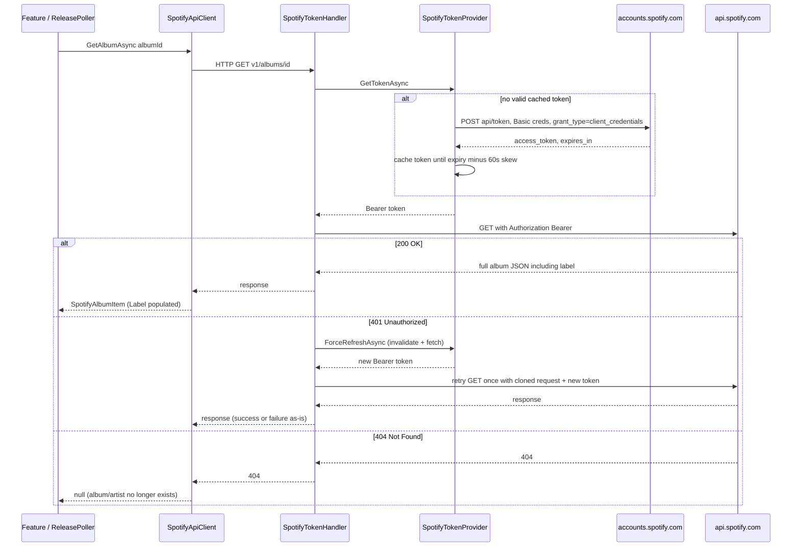

# Spotify Integration

Spotify is Katalog's **only external dependency**. Every Spotify fact the product
knows - the artists behind a label, the albums a label released, the real label a
release belongs to - arrives through this one integration. There is no user OAuth
and no Spotify account linkage in the MVP: the app authenticates once as itself with
a client-credentials **app token**, and every catalog call reuses it.

This page documents that integration end to end: how the token is obtained, cached,
refreshed and injected; which Spotify endpoints are called and why; the limits,
market and pagination rules the code enforces; the resilience pipeline that keeps
Spotify's rate limits and transient errors from becoming user-visible failures; and
how the behaviour is exercised in tests without ever touching real Spotify.

Upstream constraints that are *not* obvious from the API's existence - the fuzzy
`label:"..."` filter, the per-candidate verification call, the search `limit` ceiling
- are the reason the integration looks the way it does, so they are called out where
they apply.

## Where the code lives

| Concern | File |
|---|---|
| Client-credentials token exchange + in-memory cache + refresh serialization | `Infrastructure/Spotify/SpotifyTokenProvider.cs` |
| Bearer injection and one 401-refresh-retry | `Infrastructure/Spotify/SpotifyTokenHandler.cs` |
| Typed catalog client, URL building, pagination, `label` field model | `Infrastructure/Spotify/SpotifyApiClient.cs`, `SpotifyModels.cs`, `SpotifyApiException.cs`, `SpotifyClientNames.cs` |
| DI wiring, HttpClient base addresses, custom resilience pipeline | `Setup/SpotifySetup.cs`, `Setup/SpotifyOptions.cs` |
| Startup option validation (skipped in the OpenAPI build) | `Setup/OptionsSetup.cs`, `Setup/OpenApiGenerationSetup.cs` |
| Product consumers | `Features/Labels/SearchLabels.cs`, `Features/Artists/{SearchArtists,AddArtistToLabel}.cs`, `Features/Releases/Polling/ReleasePoller.cs` |
| Tests (never real Spotify) | `tests/.../Integration/WireMockSpotify.cs`, `tests/.../Unit/SpotifyTokenProviderTests.cs`, `.../Integration/KatalogApiFactory.cs` |

`Program.cs` wires the whole thing with a single `builder.Services.AddSpotify(...)`
call.

## Authentication: the client-credentials app token

There is **no user OAuth and no Spotify user context**. Katalog runs on an app
token obtained from the client-credentials grant, exactly as recorded in the
project's decision list ("All Spotify-data hämtas med **app-token (client
credentials flow)** - ingen Spotify-OAuth").

`SpotifyTokenProvider` is a singleton that owns the token and its lifecycle:

- **Exchange.** `FetchTokenAsync` POSTs `api/token` to the accounts host
  (`SpotifyOptions.AccountsBaseUrl`, default `https://accounts.spotify.com`) with
  form body `grant_type=client_credentials` and an HTTP **Basic** header built from
  `ClientId:ClientSecret` (the documented form; the body-credentials variant Spotify
  also accepts is not used). The response is deserialized into
  `SpotifyTokenResponse` (`access_token`, `token_type`, `expires_in`).
- **Cache with skew.** The token is cached in-process and reused until shortly
  before it expires - a fixed 60 s `ExpirySkew` refreshes it early so a request
  never races the expiry boundary. Expiry is measured with the injected
  `TimeProvider`, so time is controllable in tests.
- **Single-flight refresh.** A `SemaphoreSlim(1,1)` plus a double-checked read means
  concurrent callers that find the cache empty/stale trigger **one** token exchange,
  not one each. Ten concurrent callers hit the accounts endpoint once.
- **Force refresh.** `ForceRefreshAsync` invalidates the cache and fetches anew; it
  exists for the 401 path (below) and is covered by a unit test.
- **Failure.** A null/blank `access_token` (including a non-success status) is logged
  with the status and body and rethrown as `SpotifyApiException`, so a bad
  credential surfaces as an explicit integration error rather than an anonymous null.

### Token injection and the 401 refresh-and-retry

`SpotifyTokenHandler` is a `DelegatingHandler` registered on the catalog
`HttpClient`. On every request it asks the provider for a token and sets
`Authorization: Bearer <token>`. When Spotify answers **401 Unauthorized**, the
handler performs **exactly one** forced refresh and retries once:

- Only content-less **GET** requests are retried (a stream body cannot be replayed;
  every catalog call Katalog makes is a GET).
- The retry request is a **clone** that copies the original headers (including the
  bearer token), which is then overwritten with the refreshed token.
- If the retry also fails, the response is returned as-is and surfaces to the caller
  as a normal failure.

Because the handler owns token injection, `SpotifyApiClient` and its feature callers
never deal with tokens, expiry, or 401s - they simply issue authenticated catalog
calls.



Token acquisition followed by one verified album fetch: the provider caches and
single-flights the app token, the handler injects it and retries a single 401, and
`GetAlbumAsync` returns the full album object (the only shape that carries the
authoritative `label` field) or `null` on 404.

## The typed client and the endpoints it calls

`SpotifyApiClient` (registered as `ISpotifyApiClient`) is a thin, hand-written
wrapper over the small subset of the Web API Katalog uses. It owns URL construction,
JSON deserialization into the `Spotify*` records, and pagination; it does **not**
own auth (handler) or transient-failure handling (resilience pipeline). Its five
operations:

| Operation | Spotify endpoint | Used by | Notes |
|---|---|---|---|
| `SearchAlbumsByLabelAsync` | `GET /v1/search?q=label:"<name>"&type=album` | `SearchLabels`, `ReleasePoller` | The label-search proxy. Pages via `next`; `label` is verified separately. |
| `GetAlbumAsync` | `GET /v1/albums/{id}` | `ReleasePoller` | Full album object; the only response that carries `label`. Returns `null` on 404. |
| `GetArtistAsync` | `GET /v1/artists/{id}` | `AddArtistToLabel` | Mirrors/upserts a single artist. Returns `null` on 404. |
| `SearchArtistsAsync` | `GET /v1/search?q=...&type=artist` | `SearchArtists` | Artist-search proxy for the add-label dialog. |
| `GetArtistAlbumsAsync` | `GET /v1/artists/{id}/albums` | (discography helper) | Kept on the client and clamped to Spotify's cap; release discovery now uses label search instead. |

`ISpotifyApiClient` is the only seam the features depend on, so the transport,
token and resilience concerns stay replaceable and are stubbed wholesale in tests.

## Spotify has no label entity - the search is an album-search proxy

This is the central domain fact behind the integration's shape. Spotify's Web API
has **no label resource, no label endpoint, and no way to follow a label**. The only
label metadata is a free-text `label` field that Spotify **deprecated but still
populates on the full album object** (`GET /albums/{id}`); simplified album objects
from album search and artist discographies omit it entirely (`SpotifyAlbumItem.Label`
stays `null` there - see `SpotifyModels.cs`).

Katalog therefore models "following a label" as an **album search proxy plus
verification**:

1. **Search as an album search.** `SearchAlbumsByLabelAsync` issues
   `q=label:"<name>"` with `type=album`. The `label:"<name>"` filter is
   **undocumented-but-working**: it is verified live against real Spotify but is
   **not listed in the official spec's filter list**, so it is an empirical reliance
   documented in the code. The label name is escaped (`\` and `"` escaped, then
   `Uri.EscapeDataString`, so the wire form is `q=label%3A%22<name>%22`).
2. **No label entity in the result.** Because Spotify returns albums, not labels,
   `SearchLabels` synthesizes a single `LabelSearchResult` whose name is the
   *searched term*, with the matching albums attached. That is what the frontend
   consumes to build artist anchors from the hits.
3. **The deprecated `label` field is authoritative for verification.** Because search
   hits carry no `label`, the poller re-fetches each candidate's **full album
   object** (`GetAlbumAsync`) and uses its `label` field - deprecated but still the
   ground truth - as the single source of truth for whether a release truly belongs
   to the followed label. Exact-match verification, fuzzy-filter self-healing and the
   rename-time audit are covered in
   [Katalog - Release polling](../architecture/release-polling.md) and
   [Katalog - Domain](../domain/README.md); here the point is that they are driven
   entirely by this one deprecated field.

Because the filter matches **fuzzily** (searching "Globuli" can return albums whose
real label is "Globulin"), every search candidate is verified against the full
album object before it is trusted - one extra `GET /albums/{id}` per candidate, a
deliberate quota trade-off.

## Limits, market and pagination

`SpotifyOptions` centralizes the Spotify-side constraints the code must respect:

- **Market.** Every catalog call passes an ISO 3166-1 alpha-2 `market`
  (`SpotifyOptions.Market`, default `SE`) - Spotify's `market` parameter is
  effectively required for catalog results, and it is threaded into search,
  album and discography calls.
- **Search `limit` ceiling of 10.** Spotify caps the search `limit` at **10**
  (`SearchLimitMax`; `SearchLimitDefault` is also 10); a higher value returns
  HTTP 400 "Invalid limit". `GetArtistAlbumsAsync` has the same max-10 cap
  (`AlbumsLimitMax`). The **API never sends a `limit` above 10**, and the request
  validators reject a caller-supplied `limit` outside 1..10 with `400` before any
  Spotify call is made.
- **Clamping is safe.** Both the label search and the discography method clamp the
  requested page size to the cap with `Math.Min`. This never loses data because
  pagination runs on Spotify's `next` cursor, not on page size.
- **Pagination.** `SearchAlbumsByLabelAsync` and `GetArtistAlbumsAsync` follow
  Spotify's `next` URL. The label search accepts an optional `maxItems` to stop
  early once enough items are collected: the poller passes `null` (exhaust the full
  result set so a label with more than ten releases is never silently capped), while
  the label-search endpoint passes `maxItems: limit` to save quota (the search
  endpoint only ever shows `limit` albums, so paging further would burn quota for
  results that are then discarded).
- **Pagination URLs are validated.** Every `next` returned by Spotify is resolved
  against the client's `BaseAddress` and rejected (`SpotifyApiException`) unless it
  is same-origin (scheme/host/port match) and carries no `UserInfo` - so a
  compromised or unexpected upstream URL cannot redirect the bearer token
  off-origin.

The verified limits (search and `get-an-artists-albums` cap at 10; `get-followed`
and `recently-played` remain at 50) are recorded in `AGENTS.md` and kept honest
against Spotify's authoritative OpenAPI schema; the app never exceeds 10 on search or
albums.

## Resilience: 429s, `Retry-After` and the circuit breaker

The catalog `HttpClient` is configured in `SpotifySetup.AddSpotify` with a
**custom** resilience pipeline, deliberately not the standard handler. The pipeline,
outermost first:

```text
TotalTimeout (300 s)
  └─ Retry (3 attempts, exponential backoff from 2 s, jitter, Retry-After aware)
       └─ CircuitBreaker (30 s break, 30 s sampling, min throughput 5, failure ratio 0.5)
            └─ AttemptTimeout (15 s per attempt)
```

- **Order matters.** The *total* timeout is 300 s and the *attempt* timeout 15 s,
  inverted from the usual defaults, because Spotify 429s can carry a `Retry-After`
  longer than a default total timeout would allow - the standard handler's 30 s total
  timeout would guillotine the very retries the app depends on. A single catalog call
  is fast, so the short per-attempt timeout is safe, while the long total timeout
  gives backoff + `Retry-After` room.
- **`Retry-After` is honoured** (`ShouldRetryAfterHeader = true`), which is the
  behavior the integration relies on to respect Spotify's rolling rate limits.
- **Transient = retryable.** A response is transient on 429/5xx/408 or transport
  exception/timeout; a user-driven cancellation is **not** retried (only timeouts
  with a still-live token are). The circuit breaker uses the same predicate.
- **The token-exchange client deliberately has no resilience pipeline.** The accounts
  client is a plain `HttpClient` because the token is cached and refreshes are
  serialized, so a slow exchange is rare and does not need retry layering.

Because retries, `Retry-After` and the circuit breaker are inside the HTTP pipeline,
`SpotifyApiClient` and the poller stay simple: a Spotify transient is absorbed by the
pipeline, and only an exhausted/unhandled failure reaches the caller (where the poller
isolates it per label). See [Katalog - Release polling](../architecture/release-polling.md)
for how a per-label failure is isolated so one bad label never kills a whole cycle.

## Configuration

`SpotifyOptions` is bound from the `Spotify` configuration section and validated at
startup. Credentials never live in `appsettings.json`.

| Setting | Default | Meaning |
|---|---|---|
| `Spotify:ClientId` / `Spotify:ClientSecret` | (empty) | Client-credentials for the app token. Provided via **user secrets** or environment; never committed. |
| `Spotify:BaseUrl` | `https://api.spotify.com` | Catalog host base address for the typed client. |
| `Spotify:AccountsBaseUrl` | `https://accounts.spotify.com` | Accounts host base address for the token exchange. |
| `Spotify:Market` | `SE` | ISO 3166-1 market for catalog calls. |

- **ValidateOnStart.** `OptionsSetup.AddKatalogOptions` binds and validates the
  options (non-blank `ClientId`/`ClientSecret`, well-formed absolute base URLs) with
  `ValidateOnStart`, so a missing credential fails the app early instead of at the
  first Spotify call.
- **OpenAPI-generation exception.** The options registration is skipped when
  `OpenApiDocumentGeneration.IsActive` (the build-time `GetDocument.Insider`
  process); that host loads `appsettings.OpenApiGeneration.json` with placeholder
  values instead, so `dotnet build` regenerates the committed OpenAPI contract
  without live Postgres or Spotify. See
  [Katalog - API and persistence](../architecture/api-and-persistence.md).
- **Dev-mode environment.** User secrets are only read in the Development
  environment. `Katalog.AppHost` forces the `api` resource to Development
  (`ASPNETCORE_ENVIRONMENT`/`DOTNET_ENVIRONMENT`) precisely so the Spotify secrets
  load and `ValidateOnStart` passes; running the api in Production without injecting
  `Spotify__ClientId`/`ClientSecret` env vars fails startup. See
  [Katalog - Operations](../operations/README.md).
- **Redacted logging.** The catalog client calls `.RedactLoggedHeaders(["Authorization"])`,
  so bearer tokens never appear in HTTP logs; the token provider logs only a
  validity duration on refresh, never the token.
- **Deprecation tolerance.** Spotify's schema marks some fields (e.g. `label`) as
  deprecated. `Directory.Build.props` keeps `CS0612`/`CS0618` (obsolete-member usage)
  as warnings rather than errors so a deprecated-but-needed field does not break the
  build.

## Testing: WireMock, never real Spotify

The integration is tested against a **WireMock** stand-in for Spotify, never the
real API. `WireMockSpotify` is a small helper wrapping a `WireMockServer` that stubs
exactly the endpoints Katalog calls:

- `StubTokenExchange()` - `POST /api/token` returns a fake `access_token` with
  `expires_in`.
- `StubLabelSearch(labelName, ...)` / `StubLabelSearchPage(labelName, offset, next, ...)` -
  `/v1/search` with `q=label:"<name>"`, `type=album`, the market and a clamped
  `limit`, returning a page plus a `next` cursor (to exercise pagination).
- `StubAlbumGet(albumId, label, ...)` - `/v1/albums/{id}` returning a **full** album
  object with the real `label` field (drives the verification and fuzzy-mismatch
  logic).
- `StubArtistAlbums(artistId, ...)` - the artist-discography endpoint.
- `StubTokenExchange` + `ArtistJson`/`AlbumSearchJson`/`AlbumJson` builders for
  hand-written responses.

`KatalogApiFactory` (a `WebApplicationFactory`) points the whole app at the doubles:
`Spotify:BaseUrl` and `Spotify:AccountsBaseUrl` are overridden to the WireMock URL
and fake credentials are supplied, so **real user-secrets credentials are never
used** (config overrides win over user secrets). It also removes all `IHostedService`s
so the background poller cannot race the tests, which drive `ReleasePoller`
deterministically.

Representative tests that pin the integration's contract:

- **Token lifecycle (unit, `SpotifyTokenProviderTests`).** First call fetches and
  caches (one request across two calls); after `expires_in` + skew a fresh token is
  fetched; `ForceRefreshAsync` invalidates and re-fetches; ten concurrent callers
  trigger exactly one exchange. Uses `FakeTimeProvider` so expiry is deterministic.
- **Token exchange + Bearer flow.** Handled implicitly across the integration tests:
  every API test stubs `/api/token` first and succeeds only if the typed client can
  obtain and attach a token.
- **Rate limiting / `Retry-After`** (`PollOnce_When429WithRetryAfter_RetriesAndSucceeds`):
  a WireMock scenario returns 429 + `Retry-After: 1` on the first search, succeeds on
  the retry - proving the resilience pipeline honors `Retry-After` rather than
  guillotining it.
- **Limit enforcement** (`SearchLabels_WithLimitAboveMax_RejectsWith400`,
  `SearchArtists_WithLimitAboveMax_RejectsWith400`): a caller `limit` above 10 is
  rejected with `400` before any Spotify call.
- **Label filter on the wire** (`SearchLabels_ProxiesSpotifyAlbumSearch_WithLabelFilter`):
  the stub matches the decoded `q=label:"Globuli"`, proving the quotes survive URI
  encoding and the filter reaches Spotify unchanged. `SearchLabels_EscapesQuotesInsideLabelFilter`
  covers embedded quotes.
- **Pagination** (`PollOnce_PaginatesLabelSearchUntilExhausted`): a first page of 10
  with a `next` cursor and a second page yields 11 releases - the poller follows
  pagination so big labels are not silently capped. `SearchLabels_StopsPaging_OnceLimitReached`
  proves the search *endpoint* stops paging once `limit` items are collected (its page
  2 returns 500 and the request still succeeds).
- **Verification / fuzzy matches** (`PollOnce_ExcludesAlbumWhoseRealLabelIsANearMiss`,
  `PollOnce_IncludesExactRealLabelMatch_CaseInsensitive_AndStoresRealLabel`,
  `CreateLabel_FuzzySearchHitWhoseRealLabelIsAnotherLabel_IsNotLinked`): only an
  album whose full-object `label` exactly matches is linked; a near-miss is excluded
  and a case-insensitive match stores the album's real label.

The rules that protect these tests: never run the poller against the real Spotify API,
always stub; keep the background worker out of the factory. See
[Katalog - Testing](../testing/README.md) for the suite-level strategy and the
"never real Spotify" rule.

## Relationship to the rest of the system

The integration is deliberately isolated behind `ISpotifyApiClient` plus the
`SpotifyTokenHandler` / resilience pipeline, so:

- **Features** (`SearchLabels`, `SearchArtists`, `AddArtistToLabel`, `ReleasePoller`)
  depend only on the typed client and `SpotifyOptions.Market`; they never build URLs,
  tokens, or retry logic.
- **The poller** is the heaviest consumer, spending one search-page request plus one
  verification `GET /albums/{id}` per candidate; that call volume is why polling is a
  slow scheduled job plus one immediate poll per newly followed label, rather than a
  per-request Spotify call.
- **Read paths do not call Spotify.** Release pages are served entirely from the
  database the poller populated (see
  [Katalog - Architecture](../architecture/README.md) and
  [Katalog - Release polling](../architecture/release-polling.md)), so Spotify
  outages degrade freshness, not availability of already-discovered releases.

## Extension notes

- **Adding a Spotify endpoint.** Add an operation to `ISpotifyApiClient` +
  `SpotifyApiClient`, build the URL against `BaseAddress`, deserialize into a
  `Spotify*` record, return `null` on 404 where "does not exist" is a normal outcome,
  validate any `next` cursor with the existing same-origin check, and clamp `limit`
  to `SpotifyOptions.*Max`. Auth, retries and logging need no changes - the handler
  and pipeline already cover them.
- **Changing limits or market.** Update the constants on `SpotifyOptions` (and the
  validators that surface them as `400`); do not raise a limit past what Spotify
  actually accepts, or every call fails with HTTP 400.
- **If the `label` filter or `label` field ever disappears**, the integration's
  verification step has no substitute - the search proxy plus full-album verification
  is the whole basis for release membership. Revisit the exact-match invariants
  together with [Katalog - Domain](../domain/README.md) before changing them.
