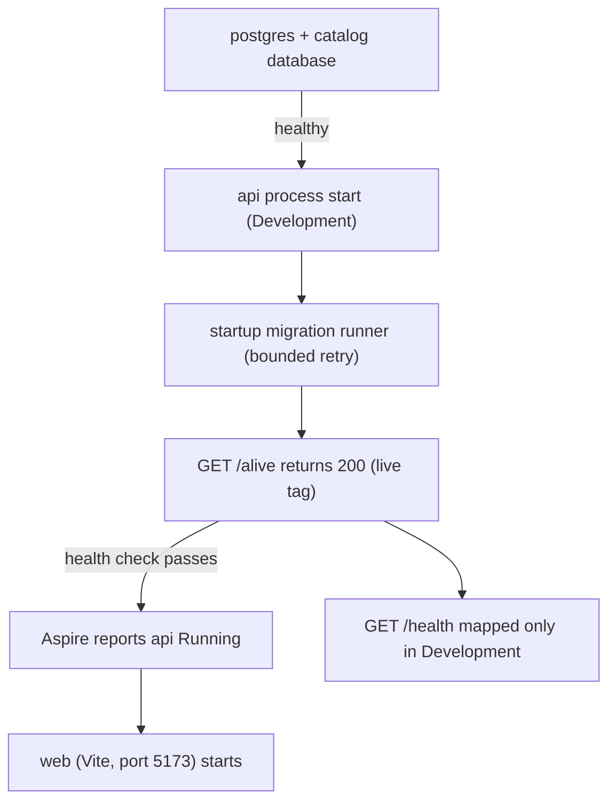

# Katalog - Operations

How the stack is run, configured, and kept healthy locally. For the system
shape see [Architecture](../architecture/README.md); for the Spotify client
and its quota/resilience constraints see
[Spotify Integration](../integrations/README.md); for the command and CI
reference see [Workflows](../workflows/README.md).

## Current deployment state

Nothing is deployed to production yet. What the repository ships instead is the
complete local stack plus the checks that keep it honest: the checked-in .NET
API, the Aspire AppHost and its PostgreSQL resource, and the committed
OpenAPI contract, all exercised by the build/test and contract-drift jobs in
`.github/workflows/ci.yml` and the frontend's own workflow
`.github/workflows/web.yml`. Change requests reach `main` through the
no-mistakes gate (`git push no-mistakes <branch>`, see
[Workflows](../workflows/README.md)). So "operations" today means running the
stack on a developer machine and keeping secrets out of the repository.

<<<<<<< HEAD
- a frontend (`web/`) with CI through `.github/workflows/web.yml`;
- the checked-in .NET API, Aspire AppHost, PostgreSQL resource, and committed
  OpenAPI contract - all exercised by `.github/workflows/ci.yml` (build + test,
  plus a contract-drift gate that regenerates the OpenAPI documents and fails on
  any diff under `contracts/`);
- a no-mistakes gate (`git push no-mistakes <branch>`);
- no production deployment yet.
=======
## Local dependencies
>>>>>>> 91156fd (docs(openwiki): partial wiki refresh for paged releases (space-bunny-free))

- .NET SDK pinned by `global.json` (10.0.100, `rollForward: latestFeature`);
  Aspire CLI 13.5.4 on `PATH` (`dotnet tool install -g Aspire.Cli --version
  13.5.4`, else build error ASPIRE009) - CI installs the same version;
  Docker (Aspire runs PostgreSQL as a container); Node.js + npm (frontend).
- Backend dev flow: `aspire run` from the solution root starts the whole stack -
  PostgreSQL, the API, and the Vite frontend - and the Aspire dashboard shows
  traces/logs. `aspire.config.json` points the CLI at
  `Katalog.AppHost/Katalog.AppHost.csproj`.
- The `api` resource is **forced to the Development environment** by the AppHost
  (`WithEnvironment("ASPNETCORE_ENVIRONMENT"/"DOTNET_ENVIRONMENT", "Development")`
  in `Resources/Api/KatalogApi.cs`). That is what loads the Spotify user-secrets
  and enables the startup migration runner; see [Spotify credentials](#spotify-credentials)
<!-- openwiki: broken internal link [#startup-migrations] heading anchor "startup-migrations" does not exist in /openwiki/operations/README.md. Fix the href or restore the target, then delete this comment. -->
  and [Startup migrations](#startup-migrations).
- The PostgreSQL `catalog` database exposes a **Reset Database** dashboard action
  (command name `reset-db`) that drops and recreates the database, also callable
  from the CLI as `aspire resource catalog reset-db`. All data is lost on reset.
  See [Reset database](#reset-database).

## Stable ports

Three resources own a fixed port so URLs are identical on every `aspire run`
(the ownership of these ports is documented in `Katalog.AppHost/Program.cs` and
pinned by the AppHost tests in
`apps/katalog-api/tests/Katalog.Api.Tests/AppHost/StablePortTests.cs`):

- **Dashboard/AppHost** - `https://localhost:15000`, pinned via the committed
  `Katalog.AppHost/Properties/launchSettings.json` `applicationUrl` (the launch
  profile is the mechanism the Aspire CLI 13.5.x uses to pin the dashboard port;
  the file is explicitly un-ignored in `.gitignore` for this reason).
- **api** - fixed host port **5192** via `WithHttpEndpoint(port: 5192)` in
  `Resources/Api/KatalogApi.cs`; the Vite proxy fallback in
  `web/vite.config.ts` references this exact port.
- **web** - fixed host port **5173** via `WithHttpEndpoint(port: 5173)` in
  `Program.cs`, matching Vite's own default so `vite --port 5173` serves the
  frontend where the docs say it lives.

## Start ordering and health

The API is started by Aspire with `WaitFor(catalogDb)` and a health check on
`/alive`, so it does not report ready until the PostgreSQL catalog database is
healthy and its startup migrations have run. The web resource references and
waits for the API.



Aspire reports the API as running only after PostgreSQL is ready, the startup
migrations complete, and the liveness check at `/alive` returns 200; the web
resource then starts.

The API maps health endpoints in `KatalogServiceDefaultsExtensions`:

- **`/alive`** - liveness; passes only the health check tagged `"live"`. Mapped
  unconditionally (it is what the AppHost health check hits even outside dev).
- **`/health`** - readiness; requires *all* health checks. Mapped **only in the
  Development environment**.

## Spotify credentials

Spotify client credentials live as **dotnet user-secrets** on the API project
(keys `Spotify:ClientId` and `Spotify:ClientSecret`), never in code,
`appsettings.json`, logs, status lines, or PR descriptions. `Katalog.Api.csproj`
carries a `UserSecretsId` so the secrets store is enabled for the project.

```sh
dotnet user-secrets set "Spotify:ClientId" "..." --project apps/katalog-api/src/Katalog.Api
dotnet user-secrets set "Spotify:ClientSecret" "..." --project apps/katalog-api/src/Katalog.Api
```

<<<<<<< HEAD
`ClientId`/`ClientSecret` must never appear in code, appsettings, logs, status
lines, or PR descriptions. `SpotifyOptions` validates them at startup (skipped
in OpenAPI-generation mode), so a missing credential fails the host early.

## Stable ports

Every `aspire run` comes up on the same URLs; all three port owners are
committed to the repo:

| Resource | URL | Pinned in |
|---|---|---|
| Aspire dashboard / AppHost | `https://localhost:15000` | `Katalog.AppHost/Properties/launchSettings.json` `applicationUrl` |
| API | `http://localhost:5192` | `WithHttpEndpoint(port: 5192)` in `Katalog.AppHost/Resources/Api/KatalogApi.cs` |
| Web frontend | `http://localhost:5173` | `WithHttpEndpoint(port: 5173)` in `Katalog.AppHost/Program.cs` |

The launch profile is the mechanism the Aspire CLI 13.5.x uses to pin the
dashboard port - without the committed `launchSettings.json` the CLI assigns a
random port per run. The web port must match Vite's own default so
`vite --port 5173` serves the frontend where the docs say it lives, and the
fixed API port is what the dev-proxy fallback in `web/vite.config.ts`
(`http://localhost:5192`) targets when Aspire has not injected `API_HTTP`.

## Local dependencies

- .NET SDK 10 (`global.json` pinned), Aspire CLI 13.5.4
  (`dotnet tool install -g Aspire.Cli --version 13.5.4`), Docker (for Aspire containers),
  Node.js + npm (frontend).
- Backend dev flow: `aspire run` from the solution root starts Postgres, the API,
  and the frontend resource; the Aspire dashboard shows traces/logs. The API runs
  in the **Development** environment under the host (`Katalog.AppHost` forces
  `ASPNETCORE_ENVIRONMENT`/`DOTNET_ENVIRONMENT` on the api resource), which is
  what loads the Spotify user-secrets and enables startup migrations - without
  it the API would start in Production, skip both, and fail options validation.
- The `catalog` Postgres resource exposes a **Reset Database** dashboard action
  (command name `reset-db`, enabled while the resource is healthy) that drops and
  recreates the database via an admin connection to the `postgres` maintenance
  database (`DROP DATABASE ... WITH (FORCE)` then plain `CREATE`), with a
  confirmation prompt; also callable from the CLI with
  `aspire resource catalog reset-db`. All data is lost on reset.
=======
- **User secrets are only read in the Development environment.** The AppHost
  forces the `api` resource to Development so the secrets load and the Spotify
  `ValidateOnStart` check passes. Running the API in Production without
  injecting `Spotify__ClientId`/`ClientSecret` environment variables makes
  option validation fail the host at startup.
- Options are validated on start (non-blank `ClientId`/`ClientSecret`,
  well-formed absolute base URLs), so a missing credential fails fast instead of
  at the first Spotify call. The only exception is the build-time OpenAPI
  generation host, which supplies placeholders from
  `appsettings.OpenApiGeneration.json`.
- Credentials are never committed; `.gitignore` excludes `secrets.json`, and the
  committed `appsettings.json` ships empty `ClientId`/`ClientSecret` values.
>>>>>>> 91156fd (docs(openwiki): partial wiki refresh for paged releases (space-bunny-free))

## Environment variables

| Variable | Used by | Meaning |
|---|---|---|
<<<<<<< HEAD
| `API_HTTP` / `API_HTTPS` | `web/vite.config.ts` | Aspire-injected API endpoint for the dev proxy (fallback `http://localhost:5192`) |
| `Spotify:ClientId` / `Spotify:ClientSecret` | backend (user-secrets) | Spotify app credentials (client credentials flow) |
| `Spotify:Market` | backend | ISO 3166-1 market for catalog calls (default `SE`) |
| `Polling:Interval` | backend | Release-poll rhythm; must be 6-24 h (default 12 h), validated at startup |
=======
| `ASPNETCORE_ENVIRONMENT` / `DOTNET_ENVIRONMENT` | AppHost (api resource) | Forced to `Development` so user-secrets load and startup migrations run. |
| `API_HTTP` / `API_HTTPS` | `web/vite.config.ts` | Aspire-injected API endpoint for the dev proxy (falls back to `http://localhost:5192`). |
| `Spotify__ClientId` / `Spotify__ClientSecret` | backend (env alternative to user-secrets) | Spotify app credentials (client-credentials flow). |
| `Spotify__BaseUrl` / `Spotify__AccountsBaseUrl` | backend (env alternative) | Spotify catalog/accounts hosts (defaults `https://api.spotify.com` / `https://accounts.spotify.com`). |
| `Spotify:ClientId` / `Spotify:ClientSecret` | backend (user-secrets) | Spotify app credentials (client credentials flow). |
| `Spotify:Market` | backend | ISO 3166-1 market for catalog calls (default `SE`). |
| `Polling:Interval` | backend | Release-polling rhythm, validated to 6-24 h (default `12:00:00`). |
| `OTEL_EXPORTER_OTLP_ENDPOINT` | backend | When set, OpenTelemetry exports to this OTLP endpoint. |

The double-underscore `Spotify__*` names are the standard .NET environment
variable encoding of the `Spotify:*` section keys; they are the way to supply
credentials from outside user-secrets (e.g. in a container or a non-Development
environment).

## Reset database

The `catalog` Postgres database resource carries a **Reset Database** dashboard
action registered by `WithResetCommand`
(`Katalog.AppHost/Resources/Infrastructure/PostgresResourceBuilderExtensions.cs`):

- Command name `reset-db`, display name "Reset Database"; run it from the
  Aspire dashboard or the CLI (`aspire resource catalog reset-db`).
- It connects as an admin to the `postgres` maintenance database, runs
  `DROP DATABASE "<db>" WITH (FORCE)` and then a plain `CREATE DATABASE "<db>"`,
  and reports success or the failure message.
- The action shows a confirmation prompt ("Are you sure? All data will be lost.")
  and is **enabled only while the resource is healthy**. All data is lost on
  reset; the schema is then recreated from EF migrations at API startup.

## Startup migrations and the CLI mode

`DatabaseMigrationRunner` applies EF Core migrations in two ways:

- **Startup (non-deployment).** `ApplyMigrationsForNonDeploymentEnvironmentOnStartupAsync`
  runs before the app serves requests, and is skipped when OpenAPI generation
  is active or the environment is Staging/Production. It retries transient
  database failures with bounded backoff (up to 5 attempts, 1-4 s delays,
  cancellation never retried) because the very first connections go through the
  Aspire DCP endpoint proxy and can briefly fail right after Postgres reports
  healthy. So `Failed executing DbCommand ... SELECT migration_id ...` lines
  during the first seconds of startup are retry noise, not a crash; a
  persistent failure still surfaces with the full exception once attempts are
  exhausted.
- **CLI mode.** Running the binary with `--migrate` or `--rollback <Migration>`
  (via `CreateMigrationBuilder`/`AddMigrationDatabase`/`RunAsync`) applies or
  reverts migrations outside the dev host and returns a process exit code
  (0 = success, 1 = failure); this is the manual/deploy/recovery path. See
  [Workflows](../workflows/README.md) for the exact `dotnet-ef` commands.

The release poller additionally waits for unapplied migrations before its loop
starts (`MigrationAwareBackgroundService`), so a slow migration idles the
worker instead of blocking host startup.
>>>>>>> 91156fd (docs(openwiki): partial wiki refresh for paged releases (space-bunny-free))

## Performance and rate limits

- The backend poller must respect Spotify's rolling 30-second rate limits and
  honor `Retry-After` on 429s (client-credentials token, batch requests, low
  poll frequency). The Spotify catalog client's resilience pipeline
  (`TotalTimeout 300s -> Retry(3, exponential from 2s, jitter, Retry-After
  aware) -> CircuitBreaker(30s break, min throughput 5) -> AttemptTimeout 15s`)
  enforces this at the transport level; see [Spotify
  Integration](../integrations/README.md) for the full pipeline and its
  rationale. The standard Aspire resilience handler is deliberately not used -
  its default total timeout would guillotine Spotify's `Retry-After` delays.
- Dev-mode quota is small - do not burn it on user-token flows (the MVP has
  none) or unbounded polling. The polling interval is validated to 6-24 h
  (`PollingOptions`), the search/albums `limit` is capped at 10, and the label
  search endpoint stops paging once its `limit` is reached to save quota.

<<<<<<< HEAD
Quota shape of release discovery: each poll pass runs a **paginated label
search** (`v1/search?q=label:"<name>"&type=album`, limit clamped to Spotify's
max 10 per request, following `next` URLs) per followed label, and then -
because Spotify's label filter matches fuzzily - issues **one
`GET /albums/{id}` per search candidate** to verify the album's real label on
the full album object. That exact verification is the captain's explicit quota
choice: correctness of label attribution over request count. Keep this in mind
before lowering the poll interval or following high-volume labels; the 6-24 h
rhythm (`PollingOptions.Validate`) is what keeps the per-candidate GETs inside
the dev-mode quota.

The HTTP pipeline is sized for this: a custom Polly pipeline
(`TotalTimeout 300 s → Retry (3 attempts, exponential + jitter, honors
Retry-After) → CircuitBreaker (30 s) → AttemptTimeout 15 s`) replaces the
standard resilience handler, whose 30 s total timeout would guillotine long
Spotify `Retry-After` waits.

## Health

The backend exposes `/health` and `/alive`; `/alive` reflects only the
`live`-tagged self check and is mapped in every environment because the AppHost
health check uses it. Aspire wires the API resource with `WaitFor(catalogDb)`
plus `WithHttpHealthCheck("/alive")`, so the API does not report "Running"
before Postgres is up and startup migrations have run.

The startup migration runner runs in Development and retries transient database
failures with bounded backoff (up to 5 attempts, 1-4 s delays, cancellation
never retried), so `Failed executing DbCommand ... SELECT migration_id ...`
lines right after Postgres reports healthy are retry noise, not a crash - the
first connections pass through the Aspire DCP endpoint proxy, which can briefly
reject connections right after the container reports healthy. Persistent
failures still surface with the full exception once attempts are exhausted.
The same binary also supports `--migrate` and `--rollback <MigrationName>` as
standalone CLI operations.
=======
## Health and observability

- Health endpoints `/alive` and `/health` (see [Start ordering and
  health](#start-ordering-and-health)). Health-check requests are excluded from
  OpenTelemetry traces to keep the dashboards clean.
- A `BackgroundServiceExceptionBehavior.StopHost` setting means an exception
  escaping a hosted service (e.g. the release poller) stops the host for a
  visible restart, rather than dying silently; expected per-cycle failures are
  already handled inside the poller.
- Traces and logs flow to the Aspire dashboard; when
  `OTEL_EXPORTER_OTLP_ENDPOINT` is set, OpenTelemetry also exports to that
  endpoint.

## Where to go next

- [Quickstart](../quickstart.md) - what the app is and how to run the stack.
- [Architecture](../architecture/README.md) - how the SPA, API, database, and
  AppHost fit together (including the stable ports).
- [Spotify Integration](../integrations/README.md) - the Spotify client, its
  resilience pipeline, and the quota/limit constraints.
- [Workflows](../workflows/README.md) - development commands, CI, and the
  no-mistakes gate.
>>>>>>> 91156fd (docs(openwiki): partial wiki refresh for paged releases (space-bunny-free))
