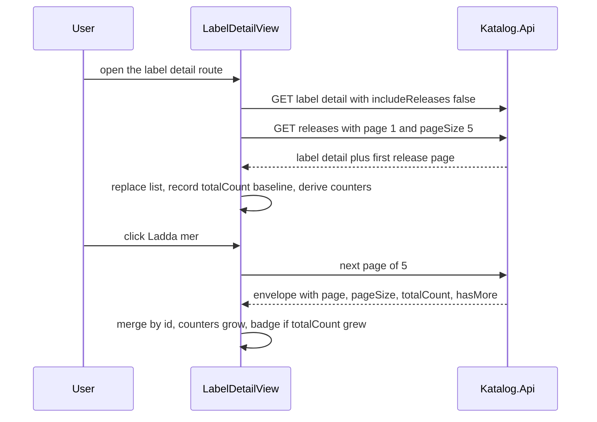

# Katalog - Quickstart

Katalog follows record **labels** through the Spotify catalog. A single user (no
login in the MVP) adds a label via Spotify search, the app links the artists
behind it, and a background poller discovers their albums - so a label's release
feed is data Katalog already owns in PostgreSQL, not a live Spotify read.

The product decisions that constrain everything below are recorded in
`README.md` ("Beslut som styr implementationen") and `AGENTS.md`: app-owned
labels, a client-credentials app token instead of Spotify OAuth, no stored
tracks, and per-label polling through Spotify's `label:"<name>"` album filter.

## What the app does today

The SPA has three routes (`web/src/router.ts`): landing `/`, the followed-label
list `/labels`, and the label detail `/labels/:id` (lazy component, `props:
true`).

<<<<<<< HEAD
- `web/` - the complete Vue SPA (landing, labels overview, label detail with
  artist/release tabs, Spotify-linked album cards).
- `apps/katalog-api/` - the .NET API, EF Core persistence, and release poller.
- `Katalog.AppHost/` - Aspire orchestration for PostgreSQL, the API, and web.
- `contracts/katalog-api/openapi.json` - the committed OpenAPI contract
  (`Katalog.Api | v1`, version 1.0.0; paths start at `/api/labels/search`).
- `.github/workflows/ci.yml` and `.github/workflows/web.yml` - backend and
  frontend CI.
- `.no-mistakes.yaml` - the no-mistakes gate configuration (opencode agent,
  OCR delegation).
- `AGENTS.md` / `CLAUDE.md` - project agent memory.
=======
On the label detail the header shows two counters that **count what is on
screen** - the number of loaded releases and the number of distinct artist
*names* credited across them - not the backend's catalogue-wide counters. The
releases arrive in pages of 5 that the user reveals with a **Ladda mer** button,
and a "N new since you started" badge appears when a later page observes a
grown `totalCount`.
>>>>>>> 91156fd (docs(openwiki): partial wiki refresh for paged releases (space-bunny-free))



The label detail round trip: the detail call and the first page of five releases
are issued together, and every later page is merged into the same list, so the
header counters grow with what is loaded.

The release endpoint is **dual-mode**: without `page`/`pageSize` it still returns
the full list for older clients, with them a `LabelReleasesResponse` envelope
(`400` on a non-positive value, `404` for an unknown label). Paging happens in
the database over the `label_albums` links the poller wrote, so no page ever
costs a Spotify call.

## Repository map

`Katalog.slnx` contains four projects; everything else is one frontend and the
generated contract.

| Path | What lives there |
|---|---|
| `apps/katalog-api/src/Katalog.Api` | The single .NET 10 minimal API: HTTP endpoints under `Api/`, one feature class per use case under `Features/`, EF Core/Npgsql persistence, and the hosted release poller. `Program.cs` is the only wiring point. |
| `apps/katalog-api/tests/Katalog.Api.Tests` | xUnit v3: unit, Testcontainers + WireMock integration, AppHost smoke, and the stable-port assertions. |
| `apps/shared/Katalog.ServiceDefaults` | Thin Aspire defaults: OpenTelemetry, health checks, service discovery, resilience, `BackgroundServiceExceptionBehavior.StopHost`. |
| `Katalog.AppHost` | Aspire orchestration: PostgreSQL server + `catalog` database, the `api` project, and the Vite app as a resource. |
| `web/` | The Vue 3 + TypeScript SPA (shadcn-vue preset `a1AhVxI`, Tailwind 4), with a **handwritten** typed client in `web/src/api/` and the paging helpers in `web/src/utils/paging.ts`. |
| `contracts/katalog-api/openapi.json` | The committed OpenAPI 3.1.1 document, regenerated by `dotnet build` and drift-checked in CI. |
| `.github/workflows/ci.yml`, `.github/workflows/web.yml` | Backend build/test/web-test/contract-drift jobs, and the frontend typecheck+build workflow. |
| `.no-mistakes.yaml`, `AGENTS.md`, `CLAUDE.md` | The delivery gate config and the project agent memory. |

## Run the whole stack

Requires .NET SDK 10 (`global.json` pins 10.0.100), the Aspire CLI 13.5.4
(`dotnet tool install -g Aspire.Cli --version 13.5.4` - the build fails with
`ASPIRE009` without it), Docker for the PostgreSQL container, and Node.

```sh
dotnet restore Katalog.slnx
dotnet build Katalog.slnx     # also regenerates contracts/katalog-api/openapi.json
dotnet test Katalog.slnx      # unit + Testcontainers/WireMock integration + AppHost smoke
aspire run                    # PostgreSQL + API + web
```

<<<<<<< HEAD
`aspire run` starts PostgreSQL, the API, and web. The AppHost forces the API
resource into the Development environment, so the Spotify user-secrets (set
once with `dotnet user-secrets set` on the API project) load and startup
migrations run. For a fresh database, use the catalog resource's **Reset
Database** dashboard action (`aspire resource catalog reset-db`).
=======
`aspire run` reads `aspire.config.json`, builds one distributed application, and
starts the `catalog` database (with a **Reset Database** dashboard action,
`aspire resource catalog reset-db`), the API, and - through
`AddViteApp("web", "../web")` - the frontend, which only starts once the API is
healthy. The AppHost forces the API to the **Development** environment so Spotify
user-secrets load and the startup migration runner runs; put the credentials
there first:
>>>>>>> 91156fd (docs(openwiki): partial wiki refresh for paged releases (space-bunny-free))

```sh
cd apps/katalog-api/src/Katalog.Api
dotnet user-secrets set "Spotify:ClientId" "<client id>"
dotnet user-secrets set "Spotify:ClientSecret" "<client secret>"
```

The URLs are the same on every run: dashboard `https://localhost:15000` (pinned
by the committed `Katalog.AppHost/Properties/launchSettings.json`), API
`http://localhost:5192`, web `http://localhost:5173`.

## Run only the frontend

```sh
cd web
npm install
npm run dev              # vite on http://localhost:5173
npm run typecheck        # vue-tsc -b --noEmit
npm test                 # vitest run (paging helpers)
npm run build            # vue-tsc -b && vite build
npm run generate:client  # @hey-api/openapi-ts -> src/api/generated
```

The SPA always calls relative `/api/*` paths; `web/vite.config.ts` proxies them
to `API_HTTP`/`API_HTTPS` when Aspire injects them, falling back to
`http://localhost:5192`, so a backend must be running for the app to show data.
`npm run generate:client` is the prepared seam for replacing the handwritten
`web/src/api/` client with one generated from the committed contract.

## Current deployment state

Nothing is deployed to production. "Running the app" means the local Aspire stack
above, and changes reach `main` through the no-mistakes gate rather than a direct
push. Secrets handling, the environment-variable contract, health endpoints, and
migration behaviour are on the [Operations page](operations/README.md).

## Where to go next

<<<<<<< HEAD
- [Architecture](architecture/README.md) - how the SPA, API, database, and
  Aspire host fit together, including the `label_albums` persistence model.
- [Domain](domain/README.md) - the label-following business model: app-owned
  labels, Spotify API constraints, and exact real-label verification semantics.
- [Release Discovery and Label Verification](workflows/release-discovery.md) -
  the end-to-end workflow of followed-label release discovery: label-filtered
  Spotify search, per-album real-label verification, idempotent upsert, and
  self-healing unlinks. Route label-following, release-polling, and Spotify
  label-verification questions here.
- [Workflows](workflows/README.md) - development commands, CI, the no-mistakes
  gate, and the OpenWiki update flow.
- [Operations](operations/README.md) - secrets, environments, ports, database
  reset, and health/retry behavior.
- [Testing](testing/README.md) - frontend and backend verification layers
  (unit, Testcontainers + WireMock integration, AppHost smoke tests).
=======
| If you want to know... | Read |
|---|---|
| How the SPA, API, database, AppHost, and the committed contract fit together | [Architecture](architecture/README.md) |
| The HTTP surface, the EF Core model, and how a release page is read | [API surface and persistence](architecture/api-and-persistence.md) |
| How the SPA turns paged responses into the feed, the counters, and the new-releases badge | [Frontend data path](architecture/frontend-data-path.md) |
| How releases are discovered, verified, and linked to a label | [Release polling](architecture/release-polling.md) |
| Why labels are app-owned, the exact-match rule, and the paging/counter domain rules | [Domain](domain/README.md) |
| How Spotify is called, authenticated, rate-limited, and tested | [Spotify integration](integrations/README.md) |
| Commands, CI jobs, contract drift, and the no-mistakes gate | [Workflows](workflows/README.md) |
| Secrets, environment variables, ports, reset and migration behaviour | [Operations](operations/README.md) |
| What the unit, integration, AppHost, and vitest suites actually assert | [Testing](testing/README.md) |
>>>>>>> 91156fd (docs(openwiki): partial wiki refresh for paged releases (space-bunny-free))
